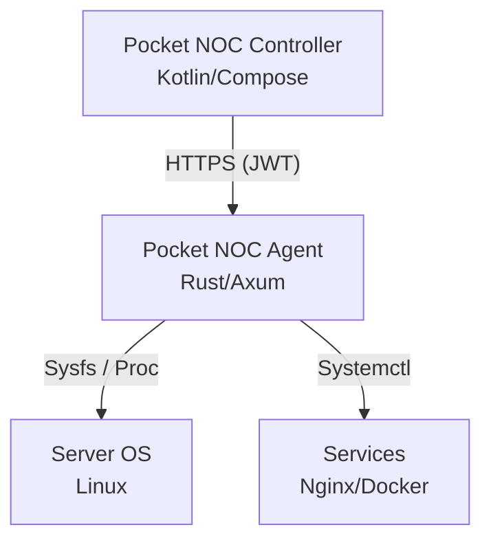

# 🌌 Pocket NOC - Server Controller

[](https://opensource.org/licenses/MIT)
[](https://kotlinlang.org/)
[](https://www.rust-lang.org/)
[](https://developer.android.com/)

**O centro de comando da sua infraestrutura, direto no seu bolso.**

O **Pocket NOC** é uma solução completa de monitoramento e gerenciamento de servidores em tempo real para dispositivos Android. Projetado para sysadmins e desenvolvedores que precisam de controle total, segurança e agilidade, mesmo longe do computador.

---

## ✨ Funcionalidades Premium

- 🚀 **Telemetria Real-time**: CPU, RAM, Disco e Temperatura com visualização futurista.
- 🛡️ **Segurança Militar**: Autenticação via JWT (JSON Web Tokens) e comunicação HTTPS/TLS.
- ⚡ **Ações de Emergência**: Reinicialização de serviços (Nginx, Docker, etc.) com um toque.
- 🚦 **Status Visual**: Semáforo de saúde da infraestrutura (Healthy/Warning/Critical).
- 📱 **Interface Futurista**: Design inspirado em Cyberpunk com elementos Neon e Glassmorphism.

---

## 🏗️ Arquitetura do Sistema

O projeto é dividido em dois componentes principais, seguindo padrões modernos de engenharia de software:



1. **Controller (Android)**: Interface construída com Jetpack Compose, seguindo o padrão **MVVM**.
2. **Agent (Rust)**: Um serviço ultraleve e performático que roda nos servidores, coletando métricas sem sobrecarregar o sistema.

---

## 📂 Estrutura do Repositório

```bash
.
├── agent/              # Código fonte do Agente (Rust)
├── controller/         # Código fonte do App Android (Kotlin)
├── docs/               # Documentação técnica detalhada (pt-br)
│   ├── API.md          # Especificação dos endpoints
│   ├── ARCHITECTURE.md # Decisões de design e fluxos
│   ├── SECURITY.md     # Camadas de proteção e auth
│   └── SETUP.md        # Guia de instalação e troubleshooting
└── README.md           # Este guia
```

---

## 🚀 Como Começar

### 1. Instalar o Agente (Servidor)

```bash
cd agent
cargo build --release
sudo systemctl enable --now ./systemd/pocket-noc-agent.service
```

### 2. Instalar o Controller (Android)

```bash
cd controller
./gradlew assembleDebug
# Instale o APK gerado no seu dispositivo
```

> [!IMPORTANT]
> Para detalhes completos de configuração, consulte o **[Guia de Instalação (docs/SETUP.md)](./docs/SETUP.md)**.

---

## 🔒 Segurança por Design

- **Zero Trust**: Nenhuma requisição é processada sem um token JWT válido.
- **Whitelist**: Apenas comandos pré-aprovados podem ser executados no servidor.
- **Minimal Footprint**: O agente em Rust usa menos de 15MB de RAM em idle.

---

## 📚 Documentação Adicional

- 🛠️ [Guia de Configuração e Instalação](./docs/SETUP.md)
- 📡 [Referência da API REST](./docs/API.md)
- 📐 [Detalhes da Arquitetura](./docs/ARCHITECTURE.md)
- 🔐 [Políticas de Segurança](./docs/SECURITY.md)

---

## 👨‍💻 Contribuição

Sinta-se à vontade para abrir Issues ou Pull Requests. O projeto segue o **Protocolo OMNI-DEV** de excelência técnica.

---

**Pocket NOC** - Por **Munique Alves Pacheco Feitoza** | *Engenharia de Software & Alta Performance*
