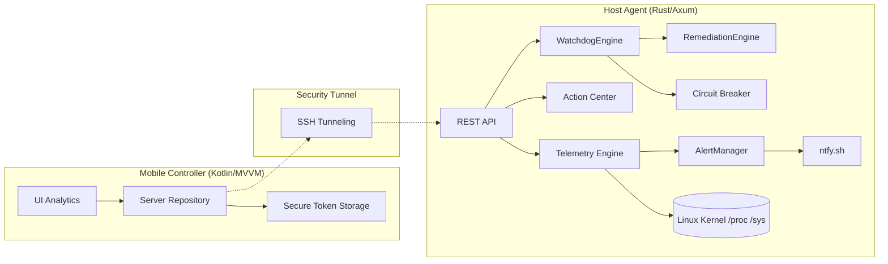

# Pocket NOC Ultra — Comandos de Infraestrutura no seu Bolso

[](https://kotlinlang.org/)
[](https://www.rust-lang.org/)
[](https://developer.android.com/)
[](https://www.gnu.org/licenses/old-licenses/gpl-2.0.en.html)

O **Pocket NOC Ultra** é uma solução de monitoramento e gestão de servidores de alto nível, projetada para quem não abre mão de controle total e segurança, mesmo em movimento. Desenvolvido com uma arquitetura híbrida **Rust + Kotlin**, o sistema entrega performance de nível de kernel com uma experiência mobile premium.

---

## Diferenciais Técnicos

- **Agente Non-Intrusive (Rust)**: Monitoramento ultra eficiente com footprint de memória < 15 MB. Zero-cost abstractions garantem que o monitor não afete a carga do host. Limites de CPU (5%) e RAM (128 MB) aplicados pelo kernel via systemd.
- **Interface Cyber-Modern (Compose)**: Design com Glassmorphism, otimizado para observabilidade rápida no mobile.
- **Munux Security**: Segurança Zero-Trust. Comunicação via túnel SSH criptografado + autenticação JWT (HMAC-SHA256) com mínimo de 32 bytes enforçado.
- **WatchdogEngine (Auto-Remediation)**: Motor inteligente que monitora serviços via probes HTTP, systemctl e TCP, reinicia serviços com falha automaticamente e usa Circuit Breaker para evitar loops infinitos de remediação.
- **Alertas com ntfy.sh**: Notificações push para o celular sem FCM ou servidor próprio, com deduplicação inteligente e cooldown de 30 minutos por alerta.
- **Hunter Mode (Process Management)**: Identifique e encerre processos pesados remotamente com precisão cirúrgica.
- **Prometheus Metrics**: Endpoint `/metrics` compatível com Prometheus/Grafana para integração com stacks de observabilidade existentes.

---

## Arquitetura de Engenharia

O ecossistema segue o **Protocolo OMNI-DEV**, priorizando desacoplamento e resiliência:



### Runtime do Agente

O agente Tokio executa três contextos simultâneos:

| Contexto | Responsabilidade |
|----------|-----------------|
| **Axum HTTP Server** | Serve requisições REST (JWT validado por middleware) |
| **Background: Alert Loop (60s)** | Coleta telemetria, analisa thresholds, dispara ntfy com deduplicação |
| **Background: WatchdogEngine (30s)** | Executa probes, gerencia Circuit Breakers, remedia falhas |

---

## API Endpoints

| Método | Rota | Auth | Descrição |
|--------|------|------|-----------|
| `GET` | `/health` | Não | Health check |
| `GET` | `/telemetry` | JWT | Snapshot completo do sistema |
| `GET` | `/alerts` | JWT | Alertas ativos |
| `POST` | `/alerts/config` | JWT | Atualiza thresholds em runtime |
| `GET` | `/processes` | JWT | Top 10 processos por CPU |
| `DELETE` | `/processes/:pid` | JWT | Encerra processo por PID |
| `GET` | `/logs` | JWT | Logs do journalctl |
| `GET` | `/services/:name` | JWT | Status de serviço systemd |
| `GET` | `/commands` | JWT | Lista comandos da whitelist |
| `POST` | `/commands/:id` | JWT | Executa comando da whitelist |
| `POST` | `/security/block-ip` | JWT | Bloqueia IP via iptables |
| `GET` | `/metrics` | JWT | Métricas formato Prometheus |
| `GET` | `/watchdog/events` | JWT | Eventos do Watchdog |
| `DELETE` | `/watchdog/events` | JWT | Limpa histórico do Watchdog |
| `POST` | `/watchdog/reset` | JWT | Reseta Circuit Breakers |
| `GET` | `/watchdog/breakers` | JWT | Estado dos Circuit Breakers |

> Documentação completa em [docs/API.md](./docs/API.md)

---

## Ecossistema de Documentação

- **[Guia de Instalação (SETUP)](./docs/SETUP.md)**: Deployment do agente, variáveis de ambiente e configuração do app.
- **[Arquitetura e Design (ARCHITECTURE)](./docs/ARCHITECTURE.md)**: Fluxo de dados, WatchdogEngine, decisões de engenharia.
- **[Protocolos de Segurança (SECURITY)](./docs/SECURITY.md)**: Zero Trust, JWT enforcement, whitelist de comandos.
- **[Referência da API (API)](./docs/API.md)**: Documentação completa de todos os endpoints.

---

## Deployment Rápido

### Servidor

```bash
# Na máquina local — compila e faz deploy em todos os servidores configurados
./deploy.sh
```

Ou manualmente:

```bash
cd agent
rustup target add x86_64-unknown-linux-musl
cargo build --release --target x86_64-unknown-linux-musl

# Binário estático em:
# target/x86_64-unknown-linux-musl/release/pocket-noc-agent
```

### Android

Compile via Android Studio ou Gradle e configure o arquivo `local.properties` com suas chaves. Veja o guia completo em [docs/SETUP.md](./docs/SETUP.md).

---

**Desenvolvido com obsessão técnica por [Munique Alves Pacheco Feitoza](https://github.com/Munique-Feitoza)**  
*Engenharia de Software | ADS | Manjaro User*
