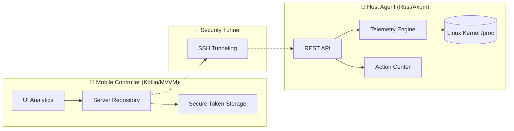

# 🌌 Pocket NOC Ultra — Comandos de Infraestrutura no seu Bolso

[](https://kotlinlang.org/)
[](https://www.rust-lang.org/)
[](https://developer.android.com/)
[](https://www.gnu.org/licenses/old-licenses/gpl-2.0.en.html)

O **Pocket NOC Ultra** é uma solução de monitoramento e gestão de servidores de alto nível, projetada para quem não abre mão de controle total e segurança, mesmo em movimento. Desenvolvido com uma arquitetura híbrida **Rust + Kotlin**, o sistema entrega performance de nível de kernel com uma experiência mobile premium.

---

## 💎 Diferenciais Técnicos

- 🦀 **Agente Non-Intrusive (Rust)**: Monitoramento ultra eficiente com footprint de memória < 15MB. Zero-cost abstractions garantem que o monitor não afete a carga do host.
- 📱 **Interface Cyber-Modern (Compose)**: Design inspirado em estética cyberpunk com Glassmorphism, otimizado para observabilidade rápida.
- 🔐 **HackerSec Core**: Segurança Zero-Trust. Comunicação via túnel SSH criptografado e autenticação robusta com JWT (HMAC-SHA256).
- 💀 **Hunter Mode (Process Management)**: Identifique e encerre processos zumbis ou pesados remotamente com precisão cirúrgica.

---

## 🏗️ Arquitetura de Engenharia

O ecossistema segue o **Protocolo OMNI-DEV**, priorizando desacoplamento e resiliência:



---

## 📂 Ecossistema de Documentação

Para manter o padrão de excelência, a documentação está organizada por domínios:

- 🛠️ **[Guia de Instalação (SETUP)](./docs/SETUP.md)**: Deployment do agente no Ubuntu e configuração do app.
- 📐 **[Arquitetura e Design (ARCHITECTURE)](./docs/ARCHITECTURE.md)**: Detalhes sobre o fluxo de dados e stack.
- 🛡️ **[Protocolos de Segurança (SECURITY)](./docs/SECURITY.md)**: Como protegemos seus acessos e chaves SSH.
- 📡 **[Referência da API (API)](./docs/API.md)**: Documentação funcional dos endpoints do agente.

---

## 🚀 Deployment Rápido

### Servidor (Ubuntu Server recomendado)

```bash
# Compile com otimizações de release
cd agent
cargo build --release

# O binário bindará apenas em localhost para segurança máxima
./target/release/pocket-noc-agent
```

### Android

Basta compilar via Android Studio ou Gradle e configurar o arquivo `local.properties` com suas chaves.

---

**Desenvolvido com obsessão técnica por [Munique Alves Pacheco Feitoza](https://github.com/Munique-Feitoza)**  
*Engenharia de Software | ADS | Manjaro User*
