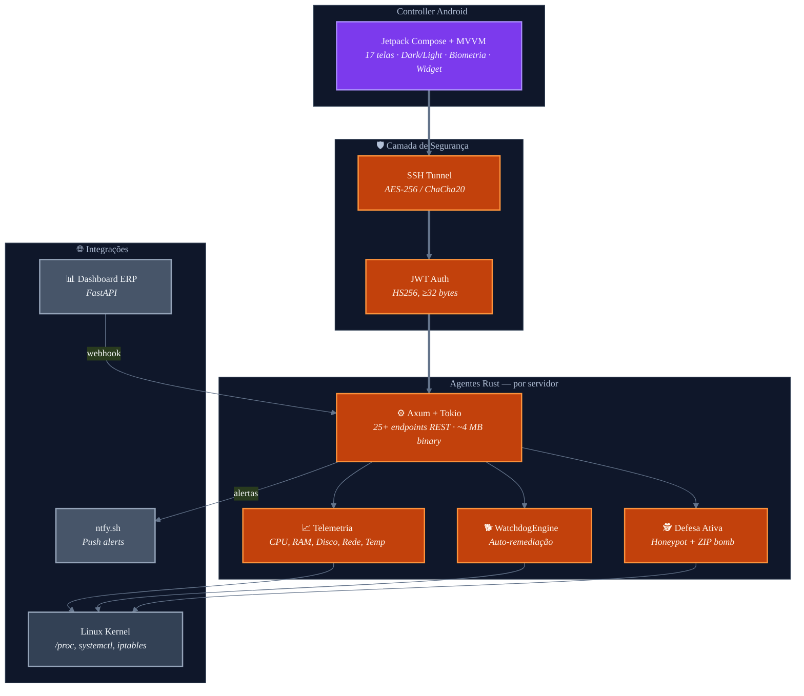

# Pocket NOC — Centro de Operações de Rede no Bolso

[](https://www.rust-lang.org/)
[](https://kotlinlang.org/)
[](https://developer.android.com/)
[](https://www.gnu.org/licenses/old-licenses/gpl-2.0.en.html)
[](https://github.com/Munique-Feitoza/pocket-noc/actions)
[](https://github.com/Munique-Feitoza/pocket-noc/actions)

Solução completa de **monitoramento**, **segurança** e **gestão de infraestrutura**. Agente em **Rust** rodando nos servidores (< 15 MB RAM, < 0.5% CPU) + app **Android** nativo em Kotlin/Jetpack Compose para controle remoto em tempo real.

---

## Arquitetura



---

## Funcionalidades

### Agente Rust

- **Telemetria completa**: CPU (por core), RAM/Swap, disco, rede (por interface), temperatura, processos, serviços systemd
- **WatchdogEngine**: detecta serviços caídos e reinicia automaticamente com circuit breaker (Closed/Open/HalfOpen)
- **Defesa ativa**: 30+ honeypot paths + ZIP bomb + auto-ban via iptables após 5 tentativas
- **Inteligência de ameaças**: geolocalização, ISP e classificação bot/humano de atacantes
- **PHP-FPM por site**: consumo de CPU/RAM por site WordPress (detecção automática Hosting)
- **Monitoramento Docker**: containers, status, portas
- **Certificados SSL**: verificação periódica (6h) com alertas de expiração
- **Backups**: status e idade dos backups
- **Alertas push**: notificações via ntfy.sh com deduplicação inteligente (cooldown 30min)
- **Métricas Prometheus**: endpoint `/metrics` para scraping
- **Audit log**: ring buffer de 1000 entradas com detalhes de cada requisição

### Controller Android

- **17 telas** com design system profissional (Material 3)
- **Dark/Light mode** com toggle manual
- **Biometria**: fingerprint/face para proteger acesso
- **Multi-servidor**: gerencia 4+ servidores simultaneamente
- **Layout adaptivo**: phone, tablet e foldable
- **SSH Tunnel**: gerenciamento automático de túneis (JSch)
- **Widget de home screen**: status do servidor na tela inicial
- **Exportação**: dados em CSV/JSON
- **Push notifications**: Firebase Cloud Messaging
- **Persistência local**: Room DB + EncryptedSharedPreferences

---

## API do Agente

Todas as rotas (exceto `/health`) requerem `Authorization: Bearer <JWT_TOKEN>`.

| Método | Rota | Descrição |
|:---|:---|:---|
| `GET` | `/health` | Health check (sem auth) |
| `GET` | `/telemetry` | Snapshot completo do sistema |
| `GET` | `/alerts` | Alertas ativos |
| `POST` | `/alerts/config` | Atualiza thresholds |
| `GET` | `/processes` | Top 10 processos |
| `DELETE` | `/processes/:pid` | Encerra processo |
| `GET` | `/logs` | Logs do journalctl |
| `GET` | `/services/:name` | Status de serviço |
| `GET` | `/commands` | Lista comandos whitelist |
| `POST` | `/commands/:id` | Executa comando |
| `POST` | `/security/block-ip` | Bloqueia IP via iptables |
| `GET` | `/security/incidents` | Incidentes de segurança |
| `POST` | `/webhook/security` | Recebe alertas do dashboard |
| `GET` | `/metrics` | Formato Prometheus |
| `GET` | `/phpfpm/pools` | PHP-FPM pools por site |
| `GET` | `/docker/containers` | Containers Docker |
| `GET` | `/ssl/check` | Certificados SSL |
| `GET` | `/backups/status` | Status de backups |
| `GET` | `/audit/logs` | Log de auditoria |
| `GET` | `/config` | Configuração do agente |
| `POST` | `/config` | Atualiza configuração |
| `GET` | `/watchdog/events` | Eventos do Watchdog |
| `GET` | `/watchdog/breakers` | Circuit Breakers |
| `POST` | `/watchdog/reset` | Reset dos breakers |

---

## Segurança

O sistema implementa **5 camadas de defesa independentes**:

| Camada | Mecanismo | Descrição |
|:---|:---|:---|
| **Perímetro** | Stealth Bind | Agente ouve apenas em `127.0.0.1` — invisível na internet |
| **Transporte** | SSH Tunnel | Criptografia AES-256/ChaCha20 via túnel SSH |
| **Aplicação** | JWT HS256 | Token com secret ≥ 32 bytes, expiração 1h |
| **Defesa Ativa** | Honeypot + ZIP bomb | 30+ paths falsos, auto-ban após 5 acessos |
| **Dados** | EncryptedSharedPrefs | Segredos criptografados via Android KeyStore |

---

## Performance

| Métrica | Valor |
|:---|:---|
| RAM do agente | 8-15 MB |
| CPU do agente (idle) | < 0.5% |
| Binário | ~4 MB (musl estático) |
| Ciclo Watchdog | 30 segundos |
| Ciclo Alertas | 60 segundos |
| Cache Telemetria | 5 segundos (L1) |
| Verificação SSL | 6 horas |

---

## Quick Start

### Deploy do Agente

```bash
# Deploy automatizado em todos os servidores
chmod +x deploy.sh
./deploy.sh
```

### Build do Controller

```bash
cd controller
./gradlew assembleDebug
./gradlew installDebug
```

---

## Documentação

| Documento | Descrição |
|:---|:---|
| [Arquitetura](./docs/ARCHITECTURE.md) | Design do sistema, diagramas UML, decisões de engenharia |
| [API Completa](./docs/API.md) | Referência de todos os 25+ endpoints com exemplos |
| [Segurança](./docs/SECURITY.md) | Modelo de ameaças, defesa em profundidade, matriz de controles |
| [Instalação](./docs/SETUP.md) | Guia completo de setup e deployment |
| [Modelos de Dados](./docs/DATA_MODELS.md) | Diagramas de classe UML (Rust + Kotlin) |
| [App Android](./docs/ANDROID_APP.md) | Arquitetura MVVM, navegação, design system |
| [Testes](./docs/TESTING.md) | Estratégia de testes e execução |
| [CI/CD e Deploy](./docs/DEPLOYMENT.md) | Pipelines GitHub Actions e processo de deploy |
| [Glossário](./docs/GLOSSARY.md) | Definições dos termos técnicos |
| [Changelog](./CHANGELOG.md) | Histórico de versões |

---

## Stack Tecnológica

| Camada | Tecnologia |
|:---|:---|
| Agente | Rust + Axum + Tokio + serde + sysinfo + procfs |
| Mobile | Kotlin + Jetpack Compose + Material 3 + Hilt |
| Networking | Retrofit 2 + OkHttp + JSch (SSH) |
| Persistência | Room + DataStore + EncryptedSharedPreferences |
| Notificações | ntfy.sh (agente) + Firebase Cloud Messaging (mobile) |
| CI/CD | GitHub Actions (Rust + Android + Release) |

---

## Licença

Este projeto é licenciado sob a [GNU General Public License v2.0](./LICENSE).

---

**Desenvolvido por [Munique Alves Pacheco Feitoza](https://github.com/Munique-Feitoza)**  
*Engenharia de Software | Análise e Desenvolvimento de Sistemas*
