# Arquitetura do Controller Android — Pocket NOC

> Documentação técnica do app Android nativo (Kotlin + Jetpack Compose).  
> Autora: **Munique Alves Pacheco Feitoza**  
> Última atualização: Abril de 2026

---

## Sumário

1. [Visão Geral](#visão-geral)
2. [Stack Tecnológica](#stack-tecnológica)
3. [Arquitetura MVVM](#arquitetura-mvvm)
4. [Injeção de Dependência (Hilt)](#injeção-de-dependência-hilt)
5. [Camada de Dados](#camada-de-dados)
6. [Camada de UI](#camada-de-ui)
7. [Navegação](#navegação)
8. [Design System](#design-system)
9. [SSH Tunneling](#ssh-tunneling)
10. [Segurança do App](#segurança-do-app)
11. [Background Workers](#background-workers)
12. [Estrutura de Diretórios](#estrutura-de-diretórios)

---

## Visão Geral

O Controller é um app Android nativo construído com Kotlin e Jetpack Compose, seguindo a arquitetura **MVVM (Model-View-ViewModel)**. Ele se conecta aos agentes Rust em cada servidor via túnel SSH, agrega telemetria, permite ações remotas e oferece uma experiência de monitoramento profissional em dispositivos móveis e tablets.

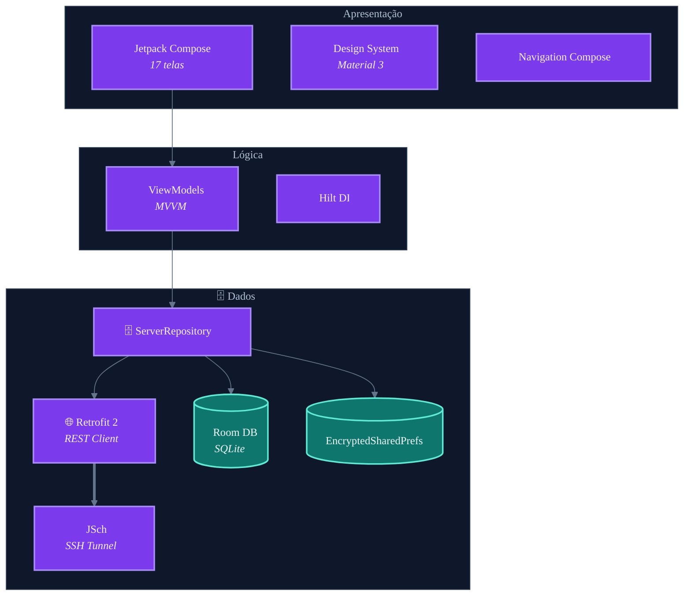

---

## Stack Tecnológica

| Componente | Tecnologia | Versão |
|:---|:---|:---|
| **Linguagem** | Kotlin | 1.9+ |
| **UI Framework** | Jetpack Compose + Material 3 | Compose BOM |
| **Arquitetura** | MVVM | — |
| **Injeção de Dependência** | Hilt (Dagger) | 2.50 |
| **Networking** | Retrofit 2 + OkHttp 3 | — |
| **Banco de Dados** | Room (SQLite) | — |
| **Preferences** | DataStore + EncryptedSharedPrefs | — |
| **SSH** | JSch | 0.2.20 |
| **Biometria** | AndroidX Biometric | — |
| **Background** | WorkManager | — |
| **Min SDK** | 24 (Android 7.0) | — |
| **Target SDK** | 34 (Android 14) | — |

---

## Arquitetura MVVM

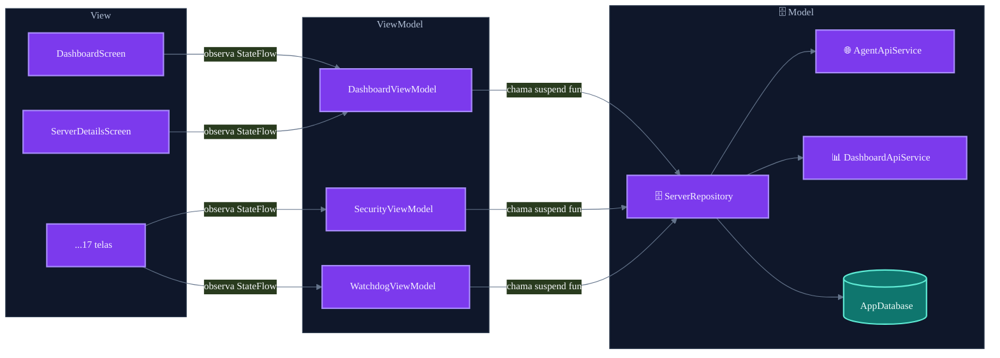

### DashboardViewModel — Estado Principal

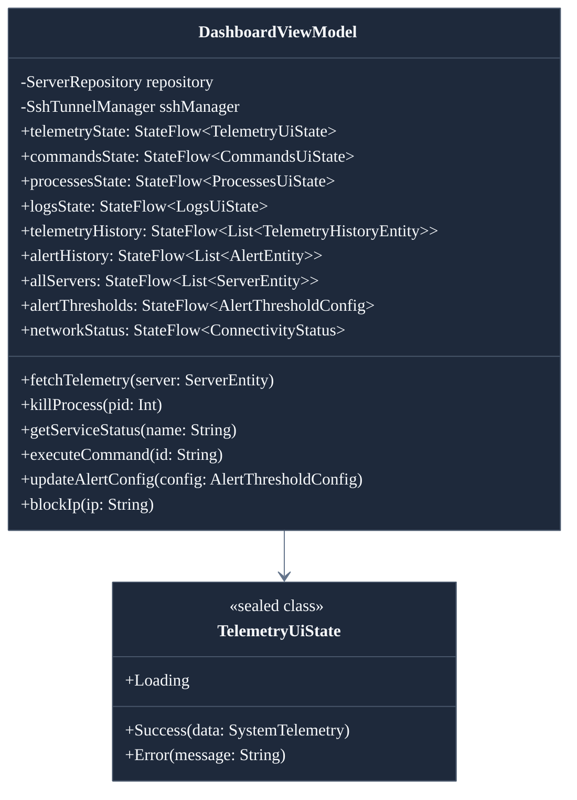

---

## Injeção de Dependência (Hilt)

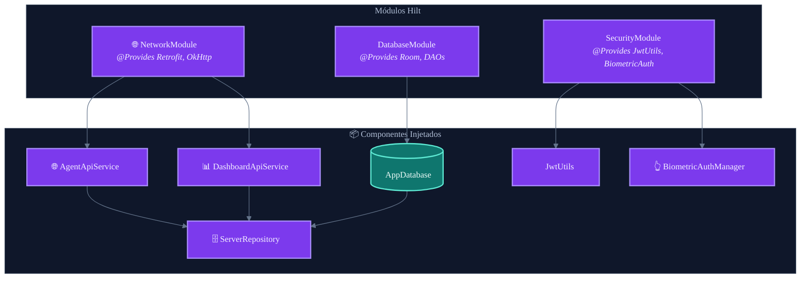

---

## Camada de Dados

### ServerRepository

O `ServerRepository` é o ponto central de acesso a dados. Ele abstrai as fontes (API remota, banco local, preferências criptografadas) e expõe operações assíncronas via coroutines.

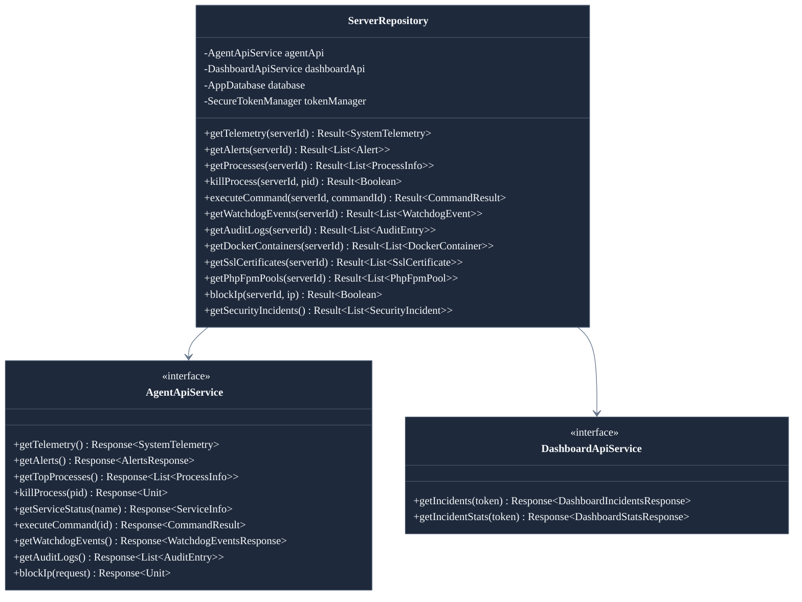

### Persistência Local

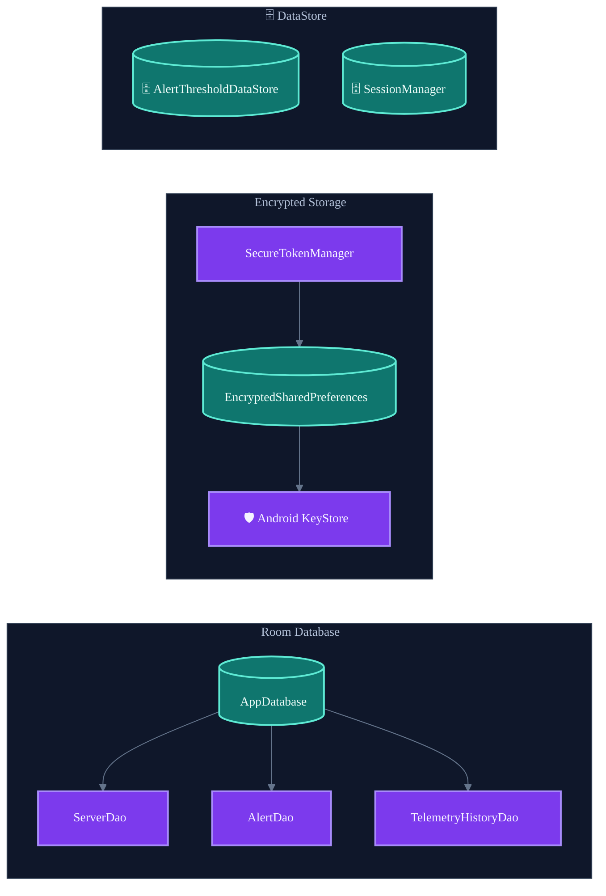

---

## Camada de UI

### Telas do App

| Tela | Arquivo | Descrição |
|:---|:---|:---|
| `SplashScreen` | `SplashScreen.kt` | Inicialização e branding |
| `LoginScreen` | `LoginScreen.kt` | Autenticação de usuário |
| `BiometricGateScreen` | `BiometricGateScreen.kt` | Proteção por biometria |
| `DashboardScreen` | `DashboardScreen.kt` | Visão geral com menu hamburger |
| `ServerListScreen` | `ServerListScreen.kt` | Lista de servidores configurados |
| `ServerDetailsScreen` | `ServerDetailsScreen.kt` | Deep dive por servidor |
| `ActionCenterScreen` | `ActionCenterScreen.kt` | Execução de comandos whitelist |
| `ProcessExplorerScreen` | `ProcessExplorerScreen.kt` | Top processos + kill by PID |
| `LogViewerScreen` | `LogViewerScreen.kt` | Visualizador journalctl em tempo real |
| `AlertSettingsScreen` | `AlertSettingsScreen.kt` | Configuração de thresholds |
| `AlertHistoryScreen` | `AlertHistoryScreen.kt` | Histórico de alertas |
| `WatchdogScreen` | `WatchdogScreen.kt` | Eventos e circuit breakers |
| `SecurityDashboardScreen` | `SecurityDashboardScreen.kt` | Incidentes do Dashboard ERP |
| `SslCheckScreen` | `SslCheckScreen.kt` | Status de certificados SSL |
| `PhpFpmScreen` | `PhpFpmScreen.kt` | PHP-FPM por site |
| `AuditLogScreen` | `AuditLogScreen.kt` | Log de auditoria da API |
| `AgentConfigScreen` | `AgentConfigScreen.kt` | Configuração remota do agente |
| `ExportScreen` | `ExportScreen.kt` | Exportação de dados (CSV/JSON) |

### ServerDetailsScreen — Análise Completa

Tela de "deep dive" por servidor, acessível via menu hamburger da Dashboard (**Análise Completa (Gráficos)**). Renderiza, na ordem:

1. **LiveStatusHeader** — status com pulso animado, último update
2. **ArcGauges** — CPU / RAM / DISCO
3. **TelemetryLineChart** — histórico de **até 24h**:
   - Fonte: `TelemetryHistoryEntity` via Room, `limit=2880` (24h × 30s)
   - Downsample para 200 buckets preservando o **MAX** de cada bucket
   - Eixo X com 4 ticks `HH:MM` distribuídos sobre o `firstTs..lastTs`
   - **Tap-to-inspect**: toque em qualquer ponto → linha vertical branca + marker magenta + label `DD/MM HH:MM · CPU X.X%` substituindo o título
4. **CpuPeaksCard** — top 3 picos de CPU das últimas 24h (supressão de adjacentes)
5. **TopSitesCpuCard** — top 5 pools PHP-FPM por CPU (via `/phpfpm/pools`)
6. SystemLoadCard (uptime + load avg)
7. **DiskUsageCard** — formata `< 1 GB` como MB, mostra filesystem, % com 1 casa decimal
8. NetworkCard
9. TemperatureCard (se houver sensor)
10. TopProcessesCard (top 5 processos com link pro ProcessExplorer)

**Limitação conhecida:** o histórico só cresce enquanto o app está ativo fazendo `fetchTelemetry()`. Para capturar picos que acontecem com o app fechado sem depender do worker periódico (que corre em frequência menor), seria necessário adicionar um ring buffer server-side no agente — feature planejada.

### Componentes Reutilizáveis

| Componente | Descrição |
|:---|:---|
| `Components.kt` | Cards, dialogs, status indicators, botões estilizados |
| `TelemetryLineChart` (em `Components.kt`) | Gráfico de linha CPU/RAM com histórico de 24h. Recebe `cpuSamples: List<Pair<Long, Float>>` e `ramSamples`. Faz downsample pra 200 buckets preservando o MAX (não perde picos). Eixo X com 4 ticks HH:MM. Suporta **tap-to-inspect**: tocar no gráfico mostra linha vertical + marker + label `DD/MM HH:MM · CPU X.X%`. |
| `CpuPeaksCard` (em `Components.kt`) | Top 3 picos de CPU nas últimas 24h com horário relativo (`2h atrás`) + clock (`03:47`). Suprime picos adjacentes (mínimo 10% da janela entre eles) pra não listar 3 amostras do mesmo evento. |
| `TopSitesCpuCard` (em `Components.kt`) | Top 5 sites (pools PHP-FPM) por CPU. Usa `/phpfpm/pools` do agente. Barra de progresso normalizada ao maior pool. |
| `DiskUsageCard` (em `ServerDetailsScreen.kt`) | Formata `< 1 GB` como MB, mostra filesystem (ext4/vfat) e % com 1 casa decimal. Corrigido erro anterior onde discos pequenos apareciam como `0/0GB`. |
| `AdaptiveLayout.kt` | Layout adaptivo — single-pane (phone) ↔ multi-pane (tablet) |
| `PocketNocTopBar.kt` | Top bar customizada com seletor de servidor |

---

## Navegação

### Diagrama de Rotas

A partir da v1.x, o `DashboardScreen` expõe as telas principais via menu hamburger — não há mais um "buraco" onde `ServerDetailsScreen` e suas filhas ficavam inalcançáveis. `WatchdogScreen` continua como aba embedded na própria Dashboard (não é rota separada do menu).

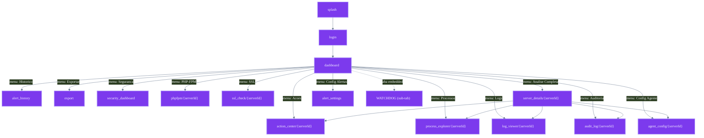

**Notas:**
- `ServerListScreen` e `BiometricGateScreen` existem no código mas são órfãos — sem entry point atual.
- `WatchdogScreen` está disponível apenas como aba dentro da Dashboard (removido do menu hamburger pra não duplicar).

### AppRoutes

Todas as rotas são definidas como `sealed class` em `AppRoutes.kt`, garantindo type-safety na navegação:

```kotlin
sealed class AppRoutes(val route: String) {
    object Splash : AppRoutes("splash")
    object BiometricGate : AppRoutes("biometric_gate")
    object Login : AppRoutes("login")
    object Dashboard : AppRoutes("dashboard")
    object ServerList : AppRoutes("server_list")
    object SecurityDashboard : AppRoutes("security_dashboard")
    object PhpFpm : AppRoutes("php_fpm")
    object SslCheck : AppRoutes("ssl_check")
    object Export : AppRoutes("export")
    // Rotas parametrizadas recebem {serverId}
    object ServerDetails : AppRoutes("server_details/{serverId}")
    object ActionCenter : AppRoutes("action_center/{serverId}")
    // ...
}
```

---

## Design System

### Tokens

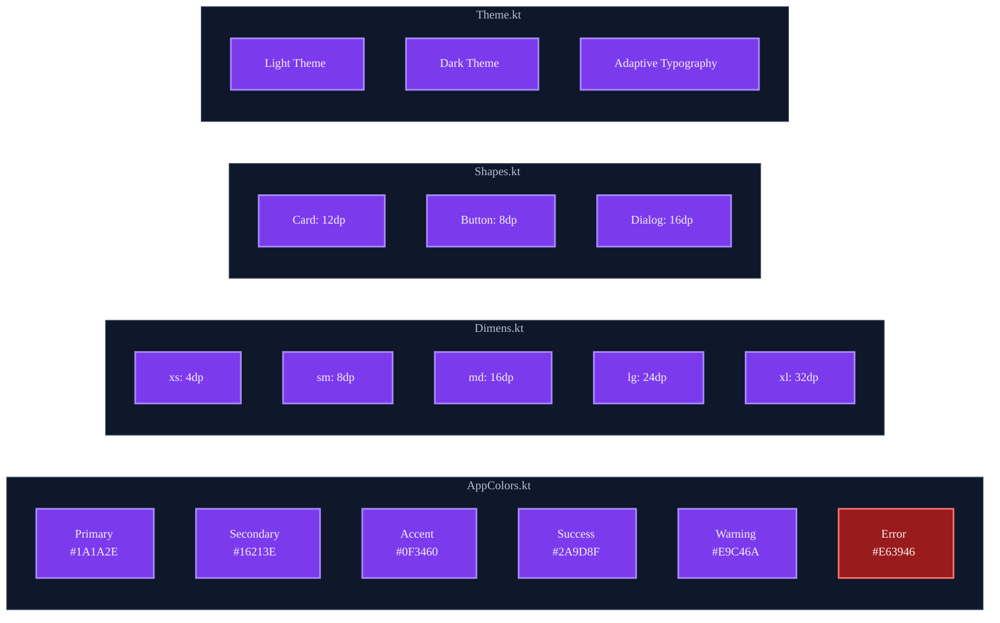

### Dark / Light Mode

O app suporta toggle manual de tema via `DashboardScreen`. O estado do tema persiste entre sessões via DataStore.

```mermaid
%%{init: {
  "theme": "base",
  "themeVariables": {
    "fontFamily": "Inter, -apple-system, Segoe UI, sans-serif",
    "fontSize": "14px",
    "primaryColor": "#1e293b",
    "primaryTextColor": "#f8fafc",
    "primaryBorderColor": "#334155",
    "lineColor": "#64748b",
    "clusterBkg": "#0f172a",
    "clusterBorder": "#334155"
  },
  "flowchart": { "curve": "basis", "padding": 20 }
}}%%
flowchart LR
    TOGGLE["🎨 Toggle button"] --> STATE["🧩 isDarkTheme: MutableState"]
    STATE --> THEME["🎨 PocketNOCTheme(darkTheme)"]
    THEME --> COLORS["🎨 AppColors.dark / AppColors.light"]
    COLORS --> COMPOSE["🎨 MaterialTheme(colorScheme)"]

    classDef androidNode fill:#7c3aed,stroke:#a78bfa,stroke-width:2px,color:#f5f3ff
    class TOGGLE,STATE,THEME,COLORS,COMPOSE androidNode
```

### Layout Adaptivo

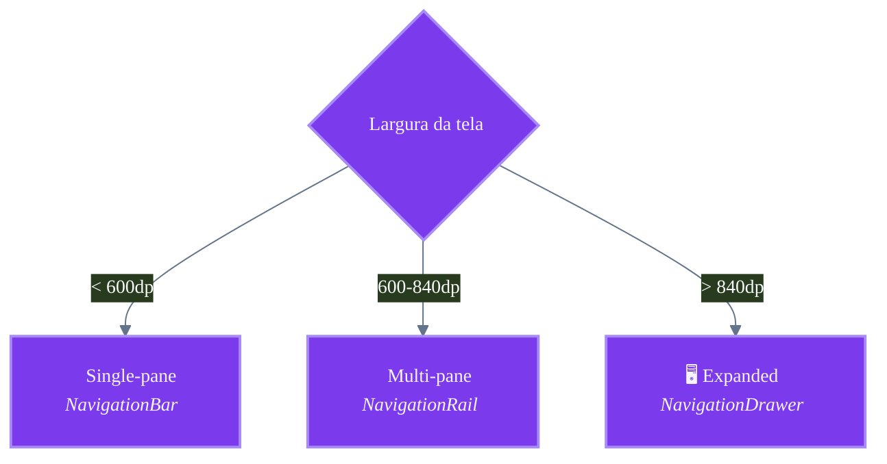

---

## SSH Tunneling

### Fluxo de Conexão

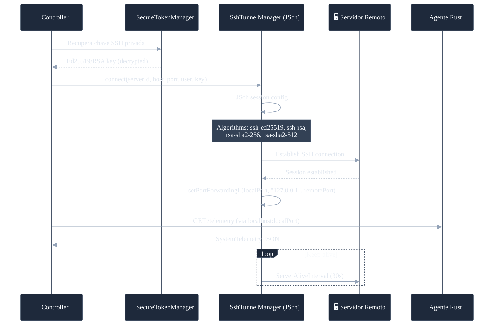

### Gerenciamento de Sessões

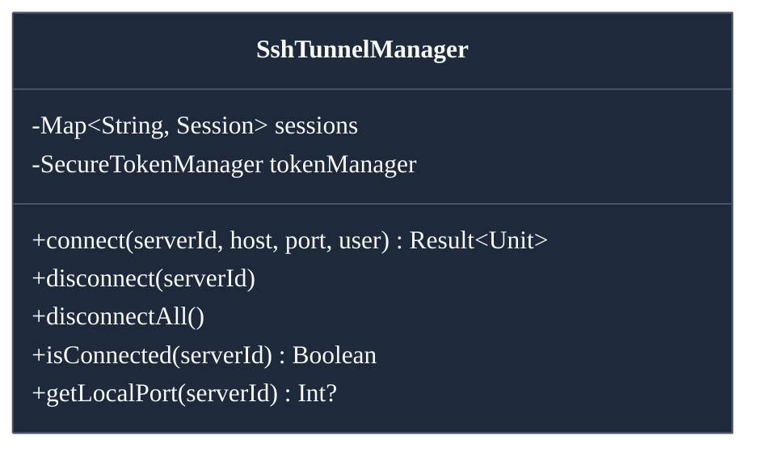

**Características:**
- Sessions cacheadas por `serverId` para reuso
- Keep-alive a cada 30 segundos
- Suporte a Ed25519 e RSA
- Max 3 auth failures antes de bloquear
- Emergency mode (skip host key checking) configurável

---

## Segurança do App

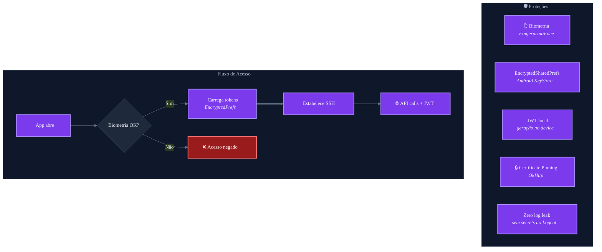

---

## Background Workers

### AlertMonitoringWorker

Worker periódico via WorkManager que faz polling de alertas em background, dispara notificação por alerta e **grava os top 3 alertas recentes em `SharedPreferences("widget_data")`** para o widget de home screen consumir.

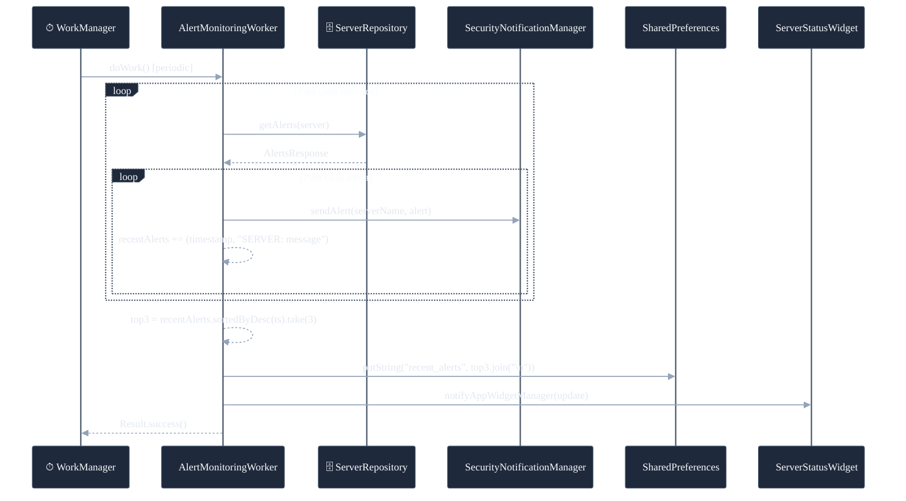

### ServerStatusWidget

Widget de home screen mostrando saúde dos servidores **e os 3 alertas mais recentes**. Lê os valores do `SharedPreferences("widget_data")` escritos pelo `AlertMonitoringWorker`.

**Layout:** `widget_server_status.xml`
- Header: título `POCKET NOC` + timestamp da última atualização
- Contadores: SERVERS / ONLINE / ALERTAS
- **Seção de alertas recentes** (TextView com `maxLines=3`): mostra até 3 alertas no formato `SERVER: mensagem`. Se vazio: `sem alertas ativos`.
- `minHeight`: `130dp` (antes era `80dp` — bumpado para caber a nova seção)

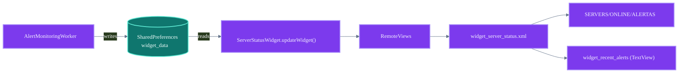

**Nota:** ao atualizar o APK após mudar o `minHeight`, o widget **precisa ser removido e re-adicionado** na home screen para o Android renderizar o novo tamanho.

---

## Estrutura de Diretórios

```
controller/app/src/main/java/com/pocketnoc/
├── MainActivity.kt                    # Single Activity
├── PocketNOCApplication.kt            # Application + Hilt
├── config/
│   └── PocketNOCConfig.kt             # Build config (local.properties)
├── data/
│   ├── api/
│   │   ├── AgentApiService.kt         # Retrofit (20+ endpoints)
│   │   ├── DashboardApiService.kt     # Dashboard ERP
│   │   └── RetrofitClient.kt          # OkHttp setup
│   ├── models/
│   │   └── Models.kt                  # 30+ data classes
│   ├── local/
│   │   ├── AppDatabase.kt             # Room database
│   │   ├── SecureTokenManager.kt      # EncryptedSharedPrefs
│   │   ├── SessionManager.kt          # Session state
│   │   ├── AlertThresholdDataStore.kt # DataStore prefs
│   │   ├── dao/                        # Room DAOs
│   │   └── entities/                   # Room entities
│   ├── repository/
│   │   └── ServerRepository.kt        # Data layer central
│   └── websocket/
│       ├── RealtimeTelemetryManager.kt
│       └── WebSocketTelemetryManager.kt
├── di/
│   ├── DatabaseModule.kt              # Room DI
│   ├── NetworkModule.kt               # Retrofit DI
│   └── SecurityModule.kt              # JWT + Biometric DI
├── notifications/
│   └── PocketNOCFirebaseService.kt    # FCM handler
├── ssh/
│   └── SshTunnelManager.kt            # JSch tunneling
├── ui/
│   ├── screens/                        # 17 Compose screens
│   ├── components/                     # Reusable components
│   ├── navigation/                     # AppNavHost + AppRoutes
│   ├── viewmodels/                     # 3 ViewModels
│   └── theme/                          # Design system tokens
├── utils/                              # Utilities (JWT, Health, etc.)
├── widget/                             # Home screen widget
└── workers/                            # WorkManager tasks
```

---

> **Documentação escrita por Munique Alves Pacheco Feitoza**  
> Engenharia de Software — Análise e Desenvolvimento de Sistemas
