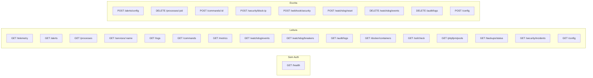

# Referência da API — Pocket NOC Agent

> Documentação completa de todos os endpoints REST expostos pelo agente Rust.  
> Autora: **Munique Alves Pacheco Feitoza**  
> Última atualização: Abril de 2026

---

## Sumário

1. [Visão Geral](#visão-geral)
2. [Autenticação](#autenticação)
3. [Health Check](#health-check)
4. [Telemetria](#telemetria)
5. [Alertas](#alertas)
6. [Processos](#processos)
7. [Serviços e Logs](#serviços-e-logs)
8. [Action Center (Comandos)](#action-center-comandos)
9. [Segurança](#segurança)
10. [Watchdog](#watchdog)
11. [Auditoria](#auditoria)
12. [Monitoramento Especializado](#monitoramento-especializado)
13. [Métricas Prometheus](#métricas-prometheus)
14. [Configuração](#configuração)
15. [Códigos de Erro](#códigos-de-erro)

---

## Visão Geral

### Base URL

```
http://127.0.0.1:9443
```

O agente ouve **exclusivamente** em `127.0.0.1`. O acesso é feito obrigatoriamente via túnel SSH:

```bash
ssh -L 9443:127.0.0.1:9443 usuario@servidor
```

### Headers Obrigatórios

| Header | Valor | Obrigatório |
|:---|:---|:---|
| `Authorization` | `Bearer <JWT_TOKEN>` | Sim (exceto `/health`) |
| `Content-Type` | `application/json` | Sim (para POST/PUT) |

### Rate Limiting

- **Limite**: 60 requisições/minuto por IP (configurável via `RATE_LIMIT_PER_MINUTE`)
- **Header de resposta**: `X-RateLimit-Remaining`
- **Ao exceder**: `429 Too Many Requests`

---

## Autenticação

### Geração de Token JWT

O token é gerado com qualquer biblioteca JWT compatível com HMAC-SHA256.

| Parâmetro | Valor |
|:---|:---|
| **Algoritmo** | HS256 (HMAC-SHA256) |
| **Secret mínimo** | 32 bytes (enforcement no startup do agente) |
| **Expiração padrão** | 3600 segundos (1 hora) |
| **Expiração máxima** | 30 dias |
| **Claims validados** | `exp`, `iat`, `sub`, `iss` |

**Exemplo de geração via script:**
```bash
./test_jwt_security.sh
```

**Exemplo de payload JWT:**
```json
{
  "sub": "admin",
  "iss": "pocket-noc",
  "iat": 1712700000,
  "exp": 1712703600,
  "scopes": ["read", "write", "admin"]
}
```

---

## Health Check

### `GET /health`

Verifica se o agente está operante. **Não requer autenticação.**

**Resposta** `200 OK`:
```json
{
  "status": "healthy",
  "service": "pocket-noc-agent",
  "timestamp": 1712700000
}
```

---

## Telemetria

### `GET /telemetry`

Retorna o snapshot completo do estado da máquina. Os dados são cacheados por **5 segundos** (cache L1) para evitar sobrecarga.

**Resposta** `200 OK`:
```json
{
  "cpu": {
    "usage_percent": 12.5,
    "cores": [
      { "core_id": 0, "usage_percent": 15.2, "frequency_mhz": 3600 },
      { "core_id": 1, "usage_percent": 9.8, "frequency_mhz": 3600 }
    ]
  },
  "memory": {
    "total_mb": 8192,
    "used_mb": 3200,
    "usage_percent": 39.0,
    "swap_total_mb": 2048,
    "swap_used_mb": 128
  },
  "disk": {
    "disks": [
      {
        "mount_point": "/",
        "total_gb": 80.0,
        "used_gb": 35.0,
        "usage_percent": 43.7,
        "filesystem": "ext4"
      }
    ]
  },
  "temperature": {
    "sensors": [
      { "label": "Package id 0", "celsius": 52.0 }
    ]
  },
  "network": {
    "interfaces": [
      {
        "name": "eth0",
        "rx_bytes": 1234567890,
        "tx_bytes": 987654321,
        "rx_packets": 123456,
        "tx_packets": 98765,
        "rx_errors": 0,
        "tx_errors": 0
      }
    ]
  },
  "security": {
    "active_ssh_sessions": 1,
    "failed_login_attempts": 3,
    "failed_logins": [
      { "ip": "203.0.113.50", "user": "root", "attempts": 3, "last_attempt": "2026-04-10T08:30:00Z" }
    ]
  },
  "processes": {
    "top_processes": [
      { "pid": 1234, "name": "nginx", "cpu_usage": 3.5, "memory_mb": 45 }
    ],
    "docker_containers_running": 3
  },
  "uptime": {
    "uptime_seconds": 345600,
    "load_average": [0.45, 0.60, 0.55]
  },
  "services": [
    { "name": "nginx", "status": "active", "description": "A high performance web server", "pid": 12345 }
  ],
  "timestamp": 1712700000
}
```

---

## Alertas

### `GET /alerts`

Retorna a lista de alertas ativos com base nos thresholds configurados.

**Resposta** `200 OK`:
```json
{
  "alerts": [
    {
      "alert_type": "highcpu",
      "message": "CPU em alta carga: 87.3% (máx: 80.0%)",
      "current_value": 87.3,
      "threshold": 80.0,
      "timestamp": 1712700000,
      "component": null
    }
  ],
  "count": 1,
  "timestamp": 1712700000
}
```

**Tipos de alerta disponíveis:**

| Tipo | Descrição | Threshold padrão |
|:---|:---|:---|
| `highcpu` | CPU acima do limite | 80% |
| `highmemory` | RAM acima do limite | 90% |
| `highdisk` | Disco acima do limite | 95% |
| `hightemperature` | Temperatura acima do limite | 85°C |
| `securitythreat` | Tentativas de login suspeitas | 10 tentativas |
| `recentreboot` | Reboot recente detectado | 5 minutos |

### `POST /alerts/config`

Atualiza os thresholds de alerta **em tempo real** (sem reiniciar o agente). Todos os campos são opcionais — campos omitidos mantêm o valor atual.

**Payload:**
```json
{
  "cpu_threshold_percent": 85.0,
  "memory_threshold_percent": 90.0,
  "disk_threshold_percent": 95.0,
  "temperature_threshold_celsius": 85.0,
  "reboot_threshold_minutes": 5,
  "security_threat_threshold": 10
}
```

**Resposta** `200 OK`:
```json
{ "status": "updated", "message": "Thresholds atualizados com sucesso" }
```

---

## Processos

### `GET /processes`

Lista os **10 processos** que mais consomem CPU.

**Resposta** `200 OK`:
```json
{
  "processes": [
    { "pid": 1234, "name": "nginx", "cpu_usage": 3.5, "memory_mb": 45 },
    { "pid": 5678, "name": "php-fpm", "cpu_usage": 2.1, "memory_mb": 128 }
  ],
  "timestamp": 1712700000
}
```

### `DELETE /processes/:pid`

Encerra um processo específico via sinal `SIGKILL`.

**Parâmetros de rota:**
- `pid` — PID do processo a ser encerrado (inteiro)

**Resposta** `200 OK`:
```json
{ "killed": true, "pid": 1234 }
```

**Erro** `404`:
```json
{ "error": "Processo não encontrado", "pid": 9999 }
```

---

## Serviços e Logs

### `GET /services/:service_name`

Consulta o status de um serviço systemd.

**Parâmetros de rota:**
- `service_name` — Nome do serviço (ex: `nginx`, `docker`, `mysql`, `php-fpm`)

**Resposta** `200 OK`:
```json
{
  "name": "nginx",
  "status": "active",
  "description": "A high performance web server and a reverse proxy server",
  "pid": 12345
}
```

**Status possíveis:** `active`, `inactive`, `failed`, `unknown`

### `GET /logs`

Acessa o buffer do `journalctl` para um serviço.

**Query params:**

| Parâmetro | Tipo | Padrão | Descrição |
|:---|:---|:---|:---|
| `service` | string | `pocket-noc-agent` | Nome do serviço systemd |
| `lines` | integer | `100` | Quantidade de linhas |

**Exemplo:** `GET /logs?service=nginx&lines=50`

**Resposta** `200 OK`:
```json
{
  "service": "nginx",
  "logs": [
    "Apr 10 12:00:00 server nginx[1234]: 200 GET /api/health 0.001s",
    "Apr 10 12:00:01 server nginx[1234]: 304 GET /static/app.js 0.000s"
  ],
  "timestamp": 1712700000
}
```

---

## Action Center (Comandos)

### `GET /commands`

Lista todos os comandos disponíveis na whitelist. A resposta é uma **lista plana** (não agrupada por categoria).

**Resposta** `200 OK`:
```json
{
  "commands": [
    {
      "id": "restart_nginx",
      "description": "Restart Nginx web server",
      "command": "systemctl",
      "args": ["restart", "nginx"]
    },
    {
      "id": "restart_mysql",
      "description": "Restart MySQL/MariaDB",
      "command": "systemctl",
      "args": ["restart", "mariadb"]
    }
  ]
}
```

**Nota:** o campo `commands` é um `List<EmergencyCommand>`. O cliente Android faz parse como `CommandListResponse(commands: List<EmergencyCommand>)`.

### `POST /commands/:id`

Executa um comando da whitelist. **Sem shell intermediário** — argumentos são passados diretamente ao binário via `Command::new()`.

**Parâmetros de rota:**
- `id` — ID do comando (deve existir na whitelist)

**Resposta** `200 OK`:
```json
{ "success": true, "output": "● nginx.service - A high performance web server\n   Active: active (running)" }
```

**Erro** `403`:
```json
{ "error": "Comando não permitido", "command": "rm_rf" }
```

---

## Segurança

### `POST /security/block-ip`

Bloqueia um endereço IP via `iptables -I INPUT -s <ip> -j DROP`.

**Payload:**
```json
{ "ip": "203.0.113.50" }
```

**Validações:**
- Apenas IPv4 ou IPv6 individuais válidos (parser `std::net::IpAddr`)
- CIDRs e ranges são **rejeitados** com `422` (previne bloqueio acidental de todo o tráfego)

**Resposta** `200 OK`:
```json
{ "blocked": true, "ip": "203.0.113.50" }
```

### `GET /security/incidents`

Retorna incidentes de segurança recebidos do Dashboard ERP via webhook.

**Resposta** `200 OK`:
```json
{
  "incidents": [
    {
      "ip": "203.0.113.50",
      "country": "CN",
      "isp": "China Telecom",
      "attack_type": "brute_force",
      "severity": "high",
      "machine_signature": "bot-scanner-v2",
      "timestamp": "2026-04-10T08:30:00Z"
    }
  ]
}
```

### `POST /webhook/security`

Endpoint para receber incidentes de segurança do Dashboard ERP. Usado pela integração FastAPI → Pocket NOC.

**Payload:**
```json
{
  "ip": "203.0.113.50",
  "country": "CN",
  "city": "Beijing",
  "isp": "China Telecom",
  "attack_type": "brute_force",
  "severity": "high",
  "machine_signature": "bot-scanner-v2"
}
```

**Resposta** `200 OK`:
```json
{ "received": true }
```

---

## Watchdog

### `GET /watchdog/events`

Retorna eventos recentes do WatchdogEngine (ring buffer de 500 eventos).

**Query params opcionais:**

| Parâmetro | Tipo | Descrição |
|:---|:---|:---|
| `server` | string | Filtra por nome de serviço |
| `status` | string | Filtra por status (`healthy`, `failing`, `recovering`) |
| `limit` | integer | Quantidade máxima de eventos (padrão: 50) |

**Exemplo:** `GET /watchdog/events?server=nginx&limit=10`

**Resposta** `200 OK`:
```json
{
  "events": [
    {
      "id": "550e8400-e29b-41d4-a716-446655440000",
      "service": "nginx",
      "status": "failing",
      "message": "HTTP probe falhou: status 502",
      "timestamp": 1712700000,
      "remediation_attempted": true
    }
  ]
}
```

### `DELETE /watchdog/events`

Limpa o histórico de eventos do Watchdog.

**Resposta:** `204 No Content`

### `POST /watchdog/reset`

Reseta todos os Circuit Breakers para o estado `Closed`.

**Resposta** `200 OK`:
```json
{ "reset": true, "message": "Todos os circuit breakers resetados" }
```

### `GET /watchdog/breakers`

Inspeciona o estado atual de cada Circuit Breaker.

**Resposta** `200 OK`:
```json
{
  "breakers": {
    "nginx": { "state": "closed", "failures": 0, "last_failure": null },
    "mysql": { "state": "open", "failures": 3, "last_failure": 1712700000 },
    "php-fpm": { "state": "halfopen", "failures": 2, "last_failure": 1712699700 }
  }
}
```

---

## Auditoria

### `GET /audit/logs`

Retorna registros de auditoria (ring buffer de 1000 entradas).

**Query params opcionais:**

| Parâmetro | Tipo | Descrição |
|:---|:---|:---|
| `limit` | integer | Quantidade de registros (padrão: 100) |
| `action` | string | Filtra por tipo de ação |

**Resposta** `200 OK`:
```json
{
  "entries": [
    {
      "id": 1,
      "timestamp": "2026-04-10T08:30:00Z",
      "action": "telemetry_read",
      "source_ip": "127.0.0.1",
      "endpoint": "/telemetry",
      "method": "GET",
      "status_code": 200,
      "details": null
    }
  ]
}
```

### `DELETE /audit/logs`

Limpa o histórico de auditoria.

**Resposta:** `204 No Content`

---

## Monitoramento Especializado

### `GET /docker/containers`

Lista todos os containers Docker no host.

**Resposta** `200 OK`:
```json
{
  "containers": [
    {
      "id": "abc123def456",
      "name": "redis-cache",
      "image": "redis:7-alpine",
      "status": "running",
      "ports": "6379/tcp"
    }
  ],
  "running_count": 3,
  "total_count": 5
}
```

### `GET /ssl/check`

Verifica o status de certificados SSL dos domínios configurados no nginx. Respeita `SSL_SKIP_DOMAINS` (ver SETUP.md) — domínios internos listados ali são pulados.

**Resposta** `200 OK`:
```json
{
  "total_domains": 12,
  "ok_count": 9,
  "expiring_count": 1,
  "expired_count": 0,
  "error_count": 2,
  "certs": [
    {
      "domain": "example.com",
      "valid": true,
      "days_remaining": 66,
      "issuer": "CN = R3, O = Let's Encrypt, C = US",
      "subject": "CN = example.com",
      "expiry_date": "Jun 15 00:00:00 2026 GMT",
      "status": "ok"
    }
  ]
}
```

**Status possíveis:**
- `ok` — certificado válido e > 7 dias restantes
- `expiring` — válido mas ≤ 7 dias (dispara ntfy priority 4)
- `expired` — `days_remaining < 0` (dispara ntfy priority 5)
- `wrong_cert` — servindo certificado de outro domínio (dispara ntfy priority 4)
- `no_cert` — sem certificado instalado (dispara ntfy priority 4 — **corrigido nesta versão**, antes não notificava)
- `error` — inacessível na porta 443 (dispara ntfy priority 4)

**Monitor periódico:** além do endpoint, o agente roda `check_all_ssl` a cada 6h em background e dispara notificação ntfy para todos os status acima exceto `ok`.

### `GET /phpfpm/pools`

Mostra estatísticas PHP-FPM por site (detecção automática Hosting). O app Android usa este endpoint para alimentar o card **TOP SITES (CPU)** em `ServerDetailsScreen`, mostrando quais pools estão puxando mais CPU.

**Resposta** `200 OK`:
```json
{
  "pools": [
    {
      "pool_name": "wp_principal",
      "cpu_percent": 12.3,
      "memory_mb": 256.5,
      "worker_count": 6
    }
  ],
  "total_workers": 24,
  "total_cpu_percent": 38.7,
  "total_memory_mb": 1024.0
}
```

**Coleta:** executa `ps -eo pid,%cpu,rss,args` filtrando processos `php-fpm: pool <name>` e agrupa por `pool_name`.

### `GET /backups/status`

Verifica o status dos backups configurados.

**Resposta** `200 OK`:
```json
{
  "backups": [
    {
      "name": "daily-db-backup",
      "last_run": "2026-04-10T03:00:00Z",
      "status": "success",
      "size_mb": 450.2,
      "age_hours": 5.5
    }
  ]
}
```

---

## Métricas Prometheus

### `GET /metrics`

Retorna métricas no formato texto Prometheus para scraping.

**Resposta** `200 OK` (`Content-Type: text/plain`):
```
# HELP pocket_noc_cpu_usage_percent Current CPU usage percentage
# TYPE pocket_noc_cpu_usage_percent gauge
pocket_noc_cpu_usage_percent 12.5

# HELP pocket_noc_memory_usage_percent Current memory usage percentage
# TYPE pocket_noc_memory_usage_percent gauge
pocket_noc_memory_usage_percent 39.0

# HELP pocket_noc_disk_usage_percent Current disk usage percentage
# TYPE pocket_noc_disk_usage_percent gauge
pocket_noc_disk_usage_percent{mount="/"} 43.7

# HELP pocket_noc_uptime_seconds System uptime in seconds
# TYPE pocket_noc_uptime_seconds counter
pocket_noc_uptime_seconds 345600

# HELP pocket_noc_ssh_sessions Active SSH sessions
# TYPE pocket_noc_ssh_sessions gauge
pocket_noc_ssh_sessions 1

# HELP pocket_noc_failed_logins Failed login attempts
# TYPE pocket_noc_failed_logins gauge
pocket_noc_failed_logins 3
```

---

## Configuração

### `GET /config`

Retorna a configuração atual do agente.

**Resposta** `200 OK`:
```json
{
  "server_id": "vps-deploy-01",
  "server_role": "wordpress",
  "port": 9443,
  "watchdog_enabled": true,
  "watchdog_interval_secs": 30,
  "watchdog_max_failures": 3,
  "watchdog_cooldown_secs": 300,
  "rate_limit_per_minute": 60
}
```

### `POST /config`

Atualiza configuração do agente em runtime. Campos omitidos mantêm valores atuais.

**Payload:**
```json
{
  "watchdog_interval_secs": 60,
  "rate_limit_per_minute": 120
}
```

**Resposta** `200 OK`:
```json
{ "status": "updated" }
```

---

## Códigos de Erro

| Código | Significado | Exemplo |
|:---|:---|:---|
| `200` | Sucesso | Requisição processada |
| `204` | Sucesso sem corpo | Deleção concluída |
| `400` | Requisição malformada | JSON inválido |
| `401` | Não autenticada | Token JWT ausente, expirado ou inválido |
| `403` | Não autorizada | Comando fora da whitelist |
| `404` | Não encontrado | PID ou serviço inexistente |
| `422` | Entidade não processável | IP malformado ou CIDR no block-ip |
| `429` | Rate limit excedido | Mais de 60 req/min do mesmo IP |
| `500` | Erro interno | Falha inesperada no agente |

**Formato padrão de erro:**
```json
{
  "error": "Descrição legível do erro",
  "code": 401,
  "details": "Token expirado em 2026-04-10T07:00:00Z"
}
```

---

## Mapa de Endpoints



---

> **Documentação escrita por Munique Alves Pacheco Feitoza**  
> Engenharia de Software — Análise e Desenvolvimento de Sistemas
