# Arquitetura do Sistema — Pocket NOC

> Documentação técnica da arquitetura distribuída do Pocket NOC.  
> Autora: **Munique Alves Pacheco Feitoza**  
> Última atualização: Abril de 2026

---

## Sumário

1. [Visão Geral](#visão-geral)
2. [Diagrama de Componentes](#diagrama-de-componentes)
3. [Stacks Tecnológicas](#stacks-tecnológicas)
4. [Arquitetura do Agente (Rust)](#arquitetura-do-agente-rust)
5. [Arquitetura do Controller (Android)](#arquitetura-do-controller-android)
6. [Fluxo de Dados de Telemetria](#fluxo-de-dados-de-telemetria)
7. [WatchdogEngine — Auto-Remediação](#watchdogengine--auto-remediação)
8. [Sistema de Segurança Ativa](#sistema-de-segurança-ativa)
9. [Modelo de Concorrência](#modelo-de-concorrência)
10. [Integrações Externas](#integrações-externas)
11. [Decisões de Engenharia](#decisões-de-engenharia)

---

## Visão Geral

O Pocket NOC segue um modelo de **Agente Distribuído** com comunicação direta entre o dispositivo móvel e os servidores monitorados. Diferente de soluções tradicionais que dependem de um servidor central (SaaS), a arquitetura elimina pontos únicos de falha e dependências externas desnecessárias.

Cada servidor de produção executa uma instância independente do agente Rust, que expõe uma API REST acessível exclusivamente via túnel SSH. O app Android atua como Controller — conecta-se a cada agente individualmente, agrega dados e permite ações remotas.

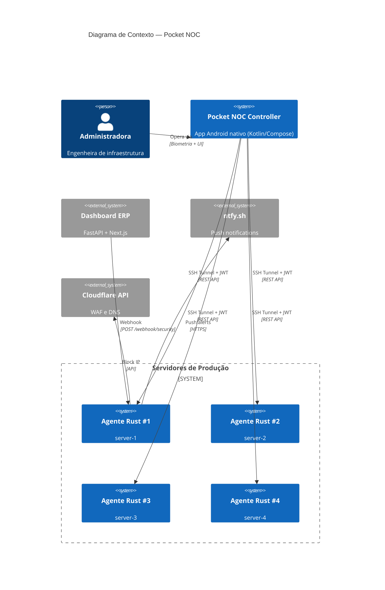

---

## Diagrama de Componentes

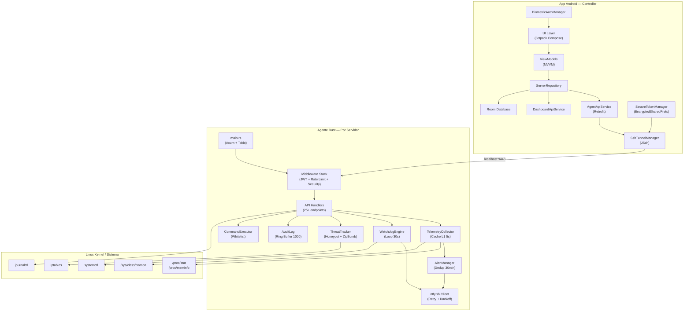

---

## Stacks Tecnológicas

| Camada | Tecnologia | Motivação |
|:---|:---|:---|
| **Agente** | Rust + Axum + Tokio | Zero-cost abstractions, sem GC, binário estático ~4 MB, footprint < 15 MB RAM |
| **Mobile** | Kotlin + Jetpack Compose + Hilt | UI reativa moderna, DI nativa, performance nativa Android |
| **Persistência Mobile** | Room + DataStore + EncryptedSharedPrefs | Gestão local de estado com credenciais criptografadas via Android KeyStore |
| **Comunicação** | SSH Tunneling (JSch) + JWT HS256 | Bicamada de segurança — criptografia de transporte + autenticação de aplicação |
| **Notificações** | ntfy.sh | Push notifications sem necessidade de FCM ou servidor proprietário |
| **CI/CD** | GitHub Actions | Pipelines automatizadas para Rust (clippy, test, build) e Android (lint, test, APK) |
| **Dashboard ERP** | FastAPI + PostgreSQL | Integração com sistema de gestão existente para inteligência de segurança |

---

## Arquitetura do Agente (Rust)

### Diagrama de Pacotes

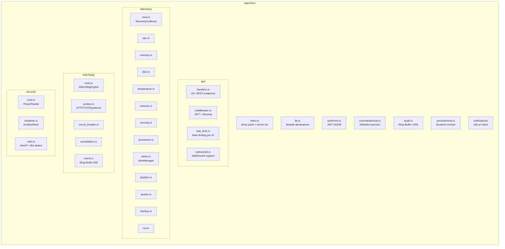

### Ciclo de Vida do Agente

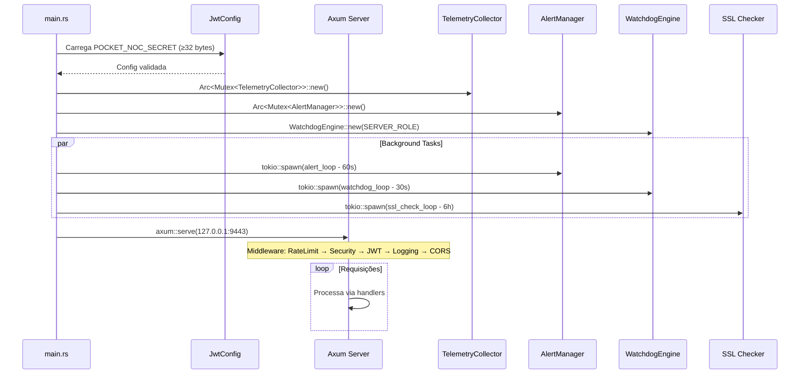

---

## Arquitetura do Controller (Android)

### Padrão MVVM

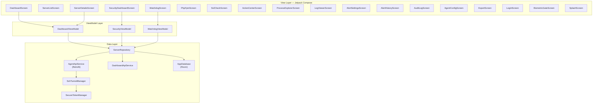

### Diagrama de Navegação

A Dashboard expõe **todas** as telas de deep-dive diretamente pelo menu hamburger (antes elas só eram acessíveis passando por `ServerListScreen → ServerDetailsScreen`, o que deixava várias telas órfãs). `WatchdogScreen` está embedded como aba na Dashboard e **não** aparece no menu (evita duplicação).

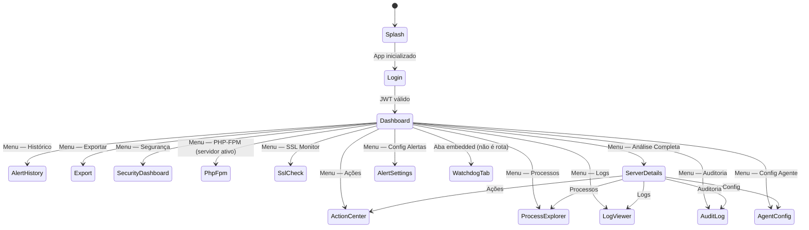

---

## Fluxo de Dados de Telemetria

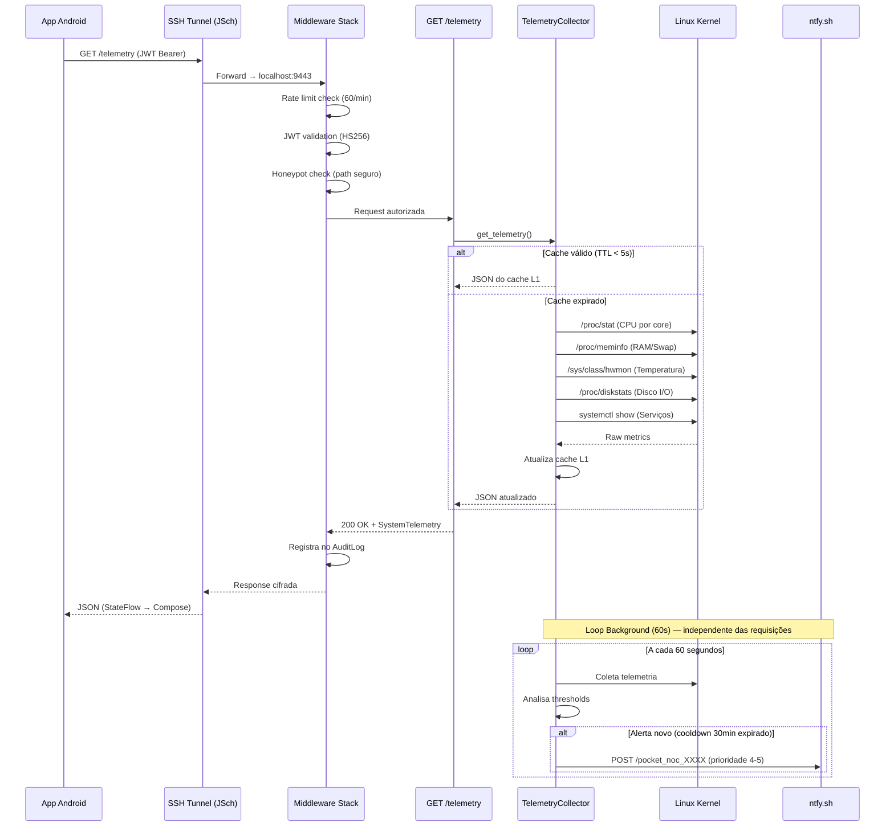

---

## WatchdogEngine — Auto-Remediação

### Diagrama de Estados do Circuit Breaker

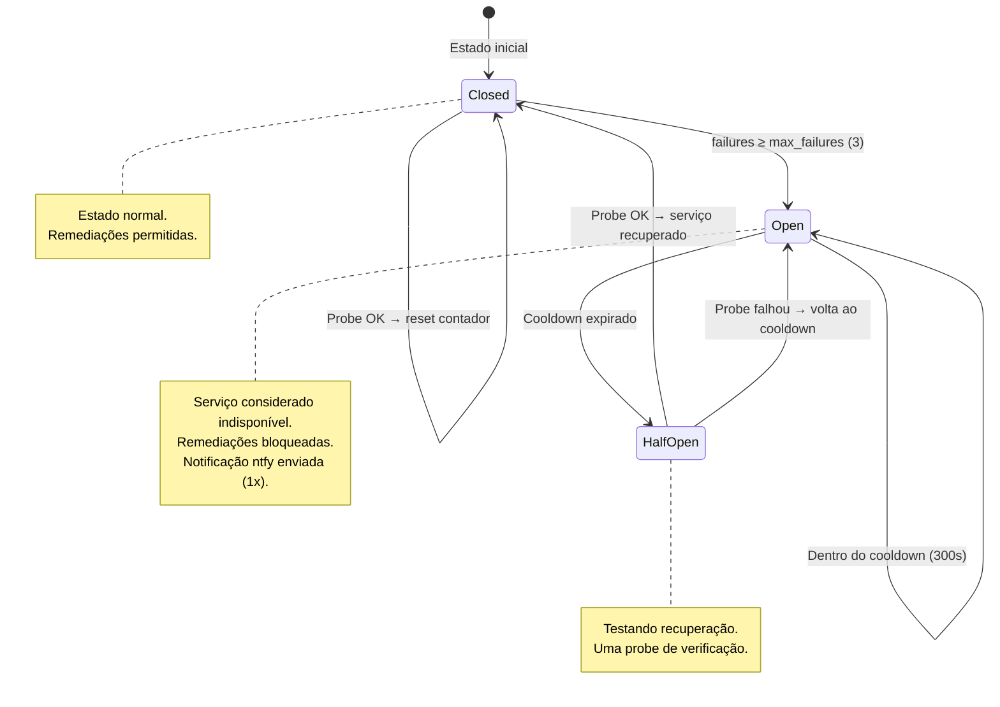

### Fluxo Completo do Watchdog

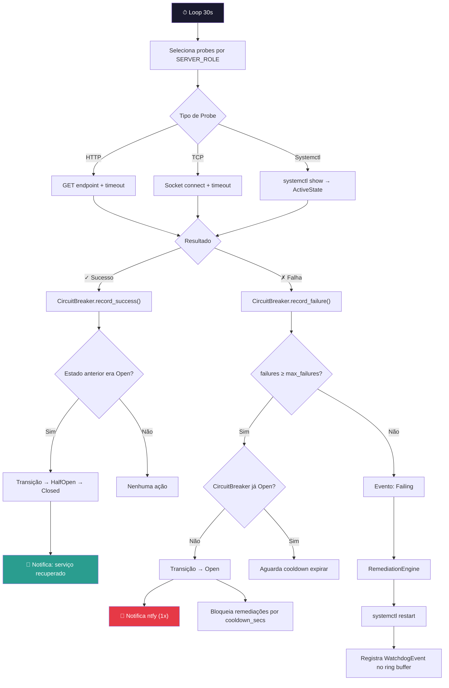

### Roles de Servidor e Probes

| Role | Serviços Monitorados | Tipo de Probe |
|:---|:---|:---|
| `wordpress` | nginx, apache2, mariadb, php81-fpm + TCP 3306/80 | Systemctl + TCP |
| `wordpress-python` | wordpress + python-api HTTP /health | Systemctl + TCP + HTTP |
| `erp` | gunicorn, postgresql, nginx + python-api + nextjs | Systemctl + TCP + HTTP |
| `python-nextjs` | nginx, apache2, mariadb, postgresql@14-main, TCP 8000/3000/80 | Systemctl + TCP |
| `database` | mysql, postgresql, TCP 3306, TCP 5432 | Systemctl + TCP |
| `generic` (padrão) | **autodetecção**: veja abaixo | Systemctl + TCP |

**Role `generic` — autodetecção dinâmica:**

A partir da v1.x, o role `generic` descobre sozinho o que monitorar ao invés de receber uma lista fixa. Cada boot do agente executa:

1. `systemctl is-active nginx` ou `nginx` — adiciona probe + TCP 80 + TCP 443
2. `systemctl list-units --state=running` filtrando `php*fpm` — adiciona probe para **cada versão ativa** (ex: `php81-fpm`, `php83rc-fpm`, `php84rc-fpm`)
3. `mariadb`/`mysql` (mariadb vence se ambos) + TCP 3306 se ativo
4. `postgresql` e todas variantes `postgresql@*-main` + TCP 5432 se ativo
5. `docker`, `redis-server` — se ativos

No deploy atual (4 servidores), o role `generic` gera 9-13 probes por servidor ao invés dos 3-4 antigos. O probe de auto-monitoramento `pocket-noc-agent` foi removido (era código morto — se o agente morrer, ele não pode se reviver).

**Probes extras por env var:**

Independente do role escolhido, o agente aceita probes ad-hoc configurados no `.env`:

```bash
# Lista de servicos systemctl — ';'-separada
EXTRA_SERVICE_PROBES=postfix;dovecot;clamav-daemon

# Probes TCP — formato: nome|host|porta
EXTRA_TCP_PROBES=memcached-tcp|127.0.0.1|11211;elasticsearch|127.0.0.1|9200

# Probes HTTP — formato: nome|url|status_esperado|latencia_degraded_ms
EXTRA_HTTP_PROBES=erp-api|http://127.0.0.1:8000/health|200|2000
```

Parsing em [agent/src/watchdog/probes.rs](../agent/src/watchdog/probes.rs) (`load_extra_probes`).

---

## Sistema de Segurança Ativa

### Fluxo de Detecção e Resposta

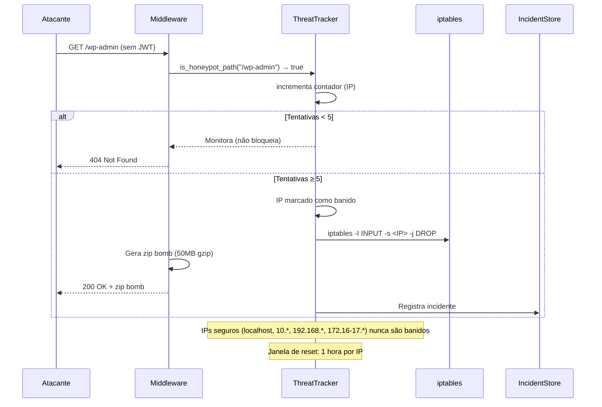

---

## Modelo de Concorrência

O agente utiliza o runtime assíncrono **Tokio** com compartilhamento de estado via `Arc<Mutex<T>>`.

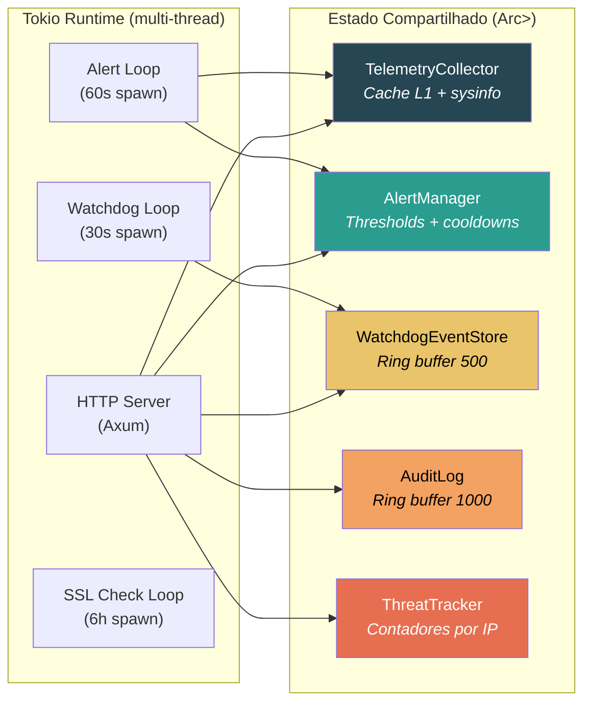

**Decisões de concorrência:**

- `Arc<Mutex<TelemetryCollector>>` — protege cache + `sysinfo::System` entre o servidor HTTP e o loop de alertas
- `Arc<Mutex<AlertManager>>` — permite atualização dinâmica de thresholds via `POST /alerts/config` sem restart
- `Arc<Mutex<WatchdogEventStore>>` — ring buffer thread-safe para eventos (VecDeque, max 500)
- `Arc<Mutex<AuditLog>>` — ring buffer para registros de auditoria (max 1000)
- `tokio::task::spawn_blocking` — usado em probes do Watchdog (systemctl, TCP) para não bloquear o executor async

---

## Integrações Externas

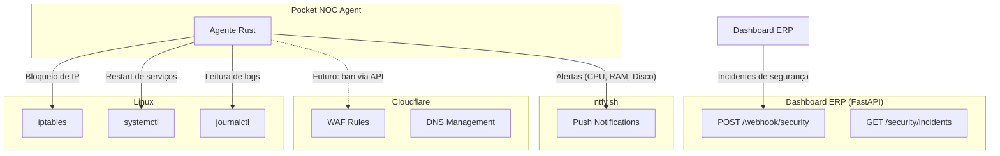

---

## Decisões de Engenharia

### Por que Rust no Agente?

Rust permite criar um binário estático (musl) que não exige runtime ou garbage collector, garantindo que o agente nunca entre em concorrência por recursos com os serviços monitorados. O sistema de tipos e o borrow checker eliminam bugs de memória e race conditions em tempo de compilação — fundamental para um serviço que roda com privilégios elevados (`CAP_KILL`, `CAP_NET_ADMIN`).

**Perfil de release otimizado:**
```toml
[profile.release]
opt-level = 3          # Otimização máxima
lto = true             # Link-time optimization
codegen-units = 1      # Compilação lenta, binário rápido
strip = true           # Remove símbolos de debug
```

Resultado: **~4 MB** binário estático, **< 15 MB** RAM, **< 0.5%** CPU.

### Por que Kotlin + Compose no Controller?

Jetpack Compose oferece UI declarativa e reativa que se integra nativamente com `StateFlow` do ViewModel — ideal para dashboards que atualizam a cada 30 segundos. Hilt (Dagger) fornece injeção de dependência com zero boilerplate, e a tipagem forte do Kotlin previne null pointer exceptions comuns em Java.

### Por que SSH Tunnel em vez de HTTPS direto?

A escolha de SSH tunneling em vez de expor o agente via HTTPS na internet foi deliberada:

1. **Zero superfície de ataque** — o agente não aparece em nenhum scan de porta
2. **Autenticação dupla** — chave SSH + JWT token
3. **Sem certificados TLS** — elimina complexidade de renovação de certificados
4. **Infraestrutura existente** — todos os servidores já têm SSH configurado

### Por que ntfy.sh em vez de FCM?

O ntfy.sh permite push notifications sem depender do Google Firebase, sem necessidade de conta Google, e funciona com qualquer cliente HTTP. O tópico é derivado automaticamente do secret JWT, eliminando configuração adicional.

---

> **Documentação escrita por Munique Alves Pacheco Feitoza**  
> Engenharia de Software — Análise e Desenvolvimento de Sistemas
