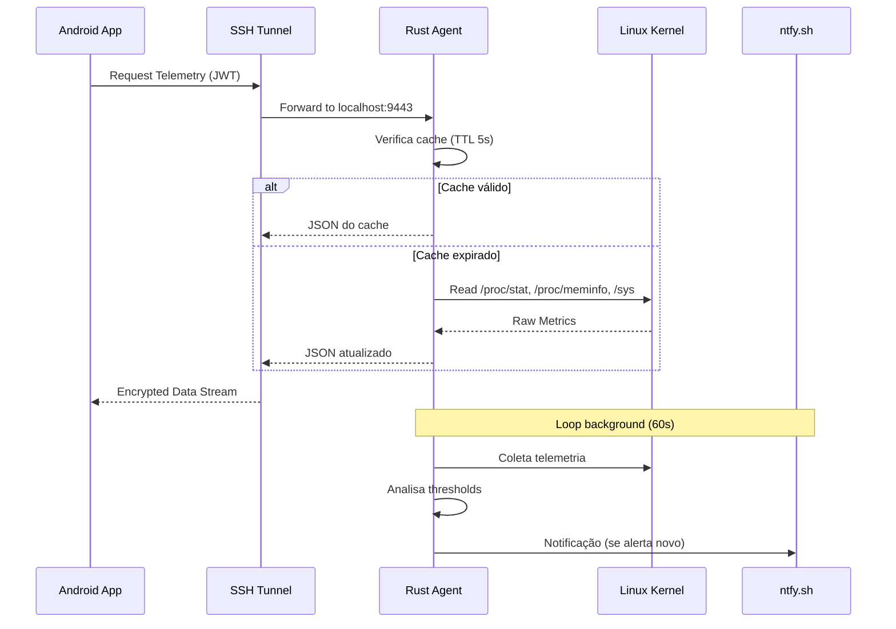
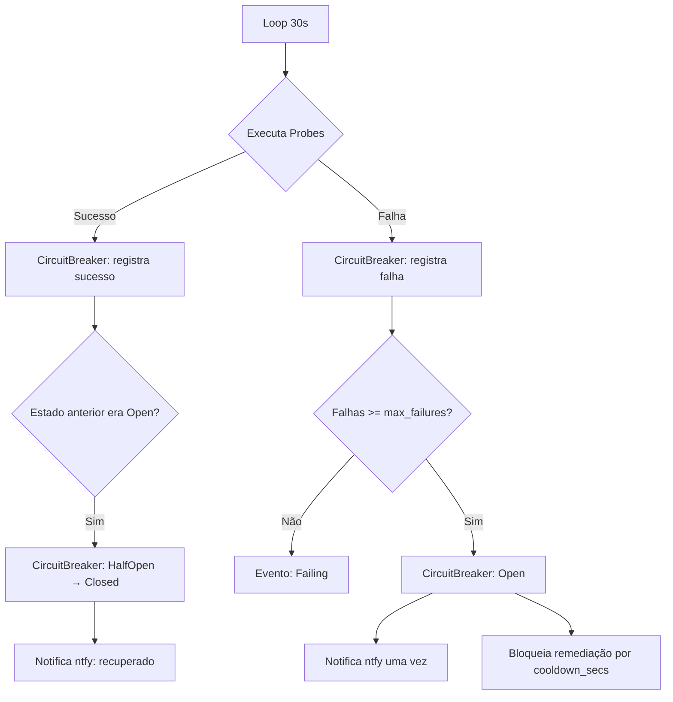

# Arquitetura do Sistema — Pocket NOC Ultra

Este documento detalha as decisões de design e a infraestrutura do ecossistema Pocket NOC. A prioridade foi construir algo resiliente, leve e confiável para ambientes de missão crítica.

## Design Macro

O Pocket NOC segue um modelo de **Agente Distribuído**. Diferente de soluções tradicionais que exigem um servidor central (SaaS), o Pocket NOC comunica-se diretamente com o host via túnel SSH, eliminando pontos únicos de falha e dependências externas desnecessárias.

### Stacks Escolhidas

| Camada | Tecnologia | Motivação |
| :--- | :--- | :--- |
| **Mobile** | Kotlin + Compose + Hilt | UI reativa moderna com DI nativa e performance nativa. |
| **Backend** | Rust + Axum + Tokio | Zero-cost abstractions, sem GC, footprint < 15 MB. |
| **Persistência Mobile** | Room + DataStore | Gestão local de estado e credenciais criptografadas. |
| **Comunicação** | SSH Tunneling + JWT HS256 | Bicamada de segurança para acesso remoto seguro. |
| **Notificações** | ntfy.sh | Push sem FCM nem servidor externo próprio. |

---

## Fluxo de Dados de Telemetria

O fluxo foi desenhado para ser unidirecional e reativo, seguindo os princípios de observabilidade:

1. **Cache L1 (5s)**: O `TelemetryCollector` mantém um cache em memória. Qualquer requisição dentro de 5 segundos da última coleta recebe o cache — zero subprocessos extras.
2. **Coleta por demanda**: Quando o cache expira, o agente lê `/proc/stat`, `/proc/meminfo`, `/sys/class/hwmon`, `diskstats` e executa subprocessos para ping, docker e serviços systemd.
3. **Loop de alertas (60s)**: Uma task em background independente coleta telemetria a cada 60 segundos, analisa thresholds e dispara notificações ntfy com deduplicação de 30 minutos.
4. **REST Buffer**: Os dados são servidos estruturados em JSON via Axum.
5. **Android Fetch**: O app realiza polling via Retrofit através do Túnel SSH.
6. **Reactive UI**: O `DashboardViewModel` atualiza o `StateFlow`, que dispara a recomposição do Jetpack Compose.



---

## WatchdogEngine

O WatchdogEngine é um motor de auto-remediação que opera em loop independente (intervalo configurável via `WATCHDOG_INTERVAL_SECS`, padrão 30s).

### Componentes

```
watchdog/
├── mod.rs              # Orquestrador — loop principal, seleção de probes por SERVER_ROLE
├── probes.rs           # Probes: HTTP, systemctl, TCP
├── circuit_breaker.rs  # Máquina de estados: Closed → Open → HalfOpen
├── remediation.rs      # RemediationEngine — decide e executa ação corretiva
└── event.rs            # WatchdogEvent + VecDeque ring buffer (500 eventos)
```

### Fluxo do Watchdog



### Roles de Servidor

O `SERVER_ROLE` define quais serviços são monitorados:

| Role | Serviços monitorados |
|------|----------------------|
| `wordpress` | nginx, mysql, php-fpm |
| `wordpress-python` | nginx, mysql, php-fpm, gunicorn |
| `erp` | nginx, mysql, redis |
| `python-nextjs` | nginx, gunicorn, node |
| `database` | mysql, redis |
| `generic` (padrão) | nginx, docker |

---

## Gestão Inteligente de Alertas (Deduplicação & Cooldown)

Para evitar flood de notificações e exaustão da API do ntfy:

- **State Tracking**: O loop de telemetria mantém um mapa em memória com chave `(AlertType, componente)` → timestamp da última notificação.
- **Cooldown de 30 minutos**: Uma nova notificação para o mesmo componente e tipo só é disparada após 1800 segundos do último aviso.
- **Auto-Cleanup**: Quando o threshold normaliza, o estado é limpo automaticamente para que o próximo evento dispare imediatamente.
- **Circuit Breaker no Watchdog**: Após `max_failures` consecutivos (padrão: 3), o circuito abre e **uma única notificação** é enviada. Remediações ficam bloqueadas por `cooldown_secs` (padrão: 300s).

---

## Decisões de Engenharia

### Por que Rust no Agente?

Rust permite criar um binário estático (musl) que não exige runtime ou GC, garantindo que o agente nunca entre em concorrência por recursos com o serviço que está monitorando. O sistema de tipos e o borrow checker eliminam bugs de memória e race conditions em tempo de compilação — crítico para um serviço que roda com privilégios elevados.

### Concorrência no Agente

- **`Arc<Mutex<TelemetryCollector>>`** — protege o estado mutável do coletor (cache + sysinfo) entre o servidor HTTP e o loop de alertas background.
- **`Arc<Mutex<AlertManager>>`** — permite atualização de thresholds via `POST /alerts/config` sem reiniciar.
- **`Arc<Mutex<WatchdogEventStore>>`** — ring buffer thread-safe para eventos do Watchdog.
- **`tokio::task::spawn_blocking`** — usado nas probes do Watchdog (systemctl, TCP) para não bloquear o executor async.

### Perfil de Release

```toml
[profile.release]
opt-level = 3
lto = true
codegen-units = 1
strip = true
```

Produz o menor e mais rápido binário possível. Binário final: ~4 MB (musl, stripped).

### Arquitetura MVVM no Android

No Controller, MVVM (Model-View-ViewModel) garante que a lógica de rede e persistência SSH sejam desacopladas da UI. Isso permite que o app mantenha fluidez mesmo com múltiplas conexões simultâneas.

---

**Documentação mantida conforme o Protocolo OMNI-DEV.**
