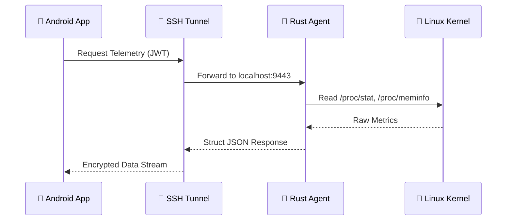

# 📐 Arquitetura do Sistema — Pocket NOC Ultra

Este documento detalha as decisões de design e a infraestrutura do ecossistema Pocket NOC. Minha prioridade aqui foi construir algo resiliente, leve e que eu pudesse confiar em um ambiente de missão crítica.

## 🏗️ Design Macro

O Pocket NOC segue um modelo de **Agente Distribuído**. Diferente de soluções tradicionais que exigem um servidor central (SaaS), o Pocket NOC comunica-se diretamente com o host via túnel SSH, eliminando pontos únicos de falha e dependências externas desnecessárias.

### Stacks Escolhidas

| Camada | Tecnologia | Motivação |
| :--- | :--- | :--- |
| **Mobile** | Kotlin + Compose | UI reativa moderna e performance nativa. |
| **Backend** | Rust + Axum | Core de sistemas. Eficiência absoluta e segurança de memória. |
| **Persistência** | Room + DataStore | Gestão local de estado e credenciais criptografadas. |
| **Comunicação** | SSH Tunneling + JWT | Bicamada de segurança para acesso remoto. |

---

## 🔄 Fluxo de Dados de Telemetria

O fluxo foi desenhado para ser unidirecional e reativo, seguindo os princípios de observabilidade:

1. **Kernel Poll**: O Engine em Rust lê diretamente o `/proc` e `/sys` a cada segundo.
2. **REST Buffer**: Os dados são estruturados em JSON e servidos via Axum.
3. **Android Fetch**: O app realiza polling via Retrofit através do Túnel SSH.
4. **Reactive UI**: O `DashboardViewModel` atualiza o `StateFlow`, que dispara a recomposição do Jetpack Compose.

---

## 🔔 Gestão Inteligente de Alertas (Deduplicação)

Para evitar o "Flood" de notificações (problema comum em sistemas de monitoramento), o Pocket NOC Agent implementa uma camada de deduplicação stateful:

- **State Tracking**: O loop de telemetria mantém um mapa em memória dos últimos alertas notificados.
- **Delta Notification**: Uma nova notificação só é disparada se a mensagem do alerta mudar (ex: aumento no número de tentativas de intrusão) ou se for um novo tipo de alerta.
- **Auto-Cleanup**: Quando o threshold volta ao normal e o alerta deixa de existir na análise, o estado é limpo automaticamente.

---

## 🎯 Decisões de Engenharia (Trade-offs)

### Por que Rust no Agente?

Eu poderia ter usado Go ou Python, mas para um agente de monitoramento, o uso de RAM é sagrado. Rust me permitiu criar um binário estático que não exige runtime ou GC (Garbage Collector), garantindo que o agente nunca entre em "concorrência" por recursos com o serviço que ele está monitorando (como um banco de dados pesado).

### Arquitetura MVVM no Android

No Controller, utilizei MVVM (Model-View-ViewModel) para garantir que a lógica de rede e persistência do SSH sejam desacopladas da UI. Isso permite que o app mantenha a fluidez mesmo com múltiplas conexões simultâneas.

---
**Documentação mantida conforme o Protocolo OMNI-DEV.**
