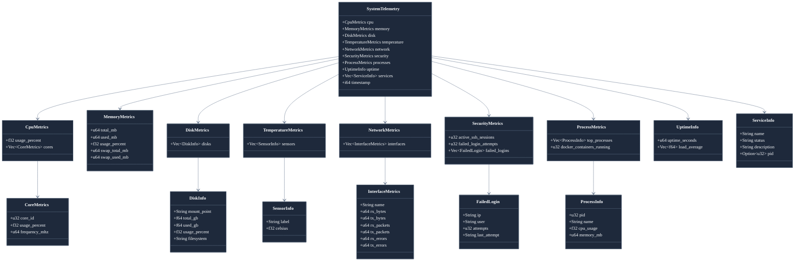
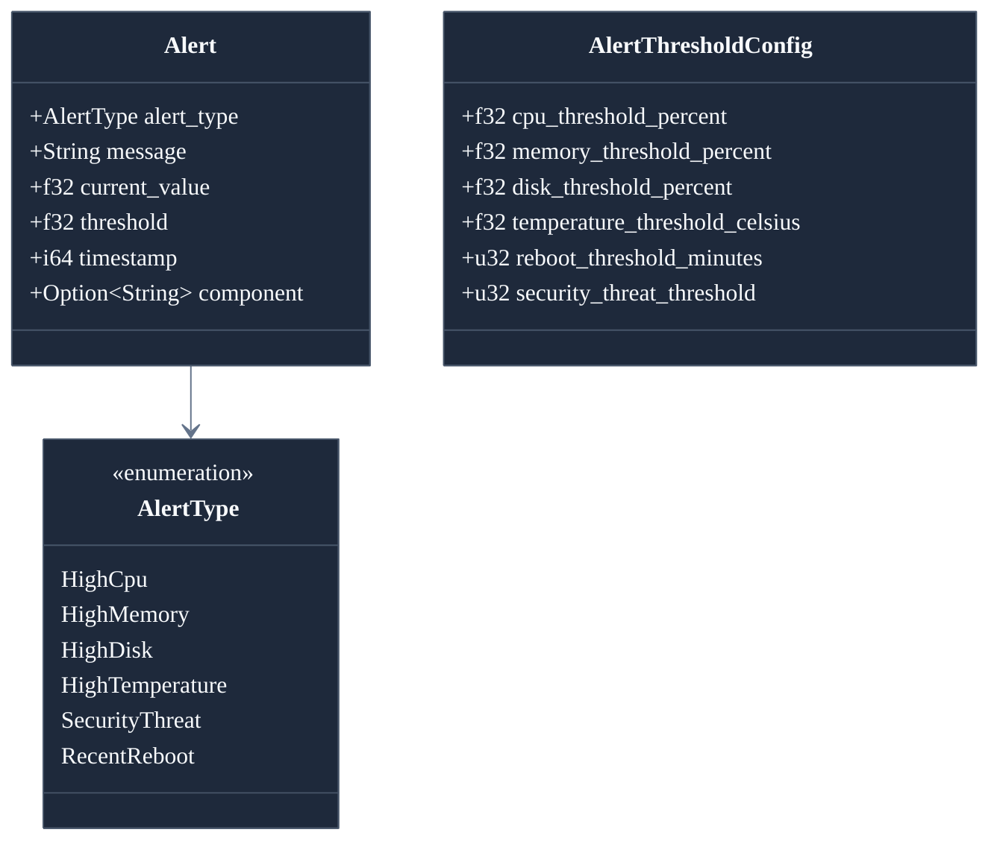
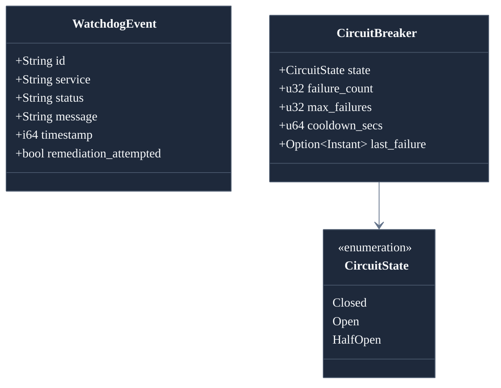
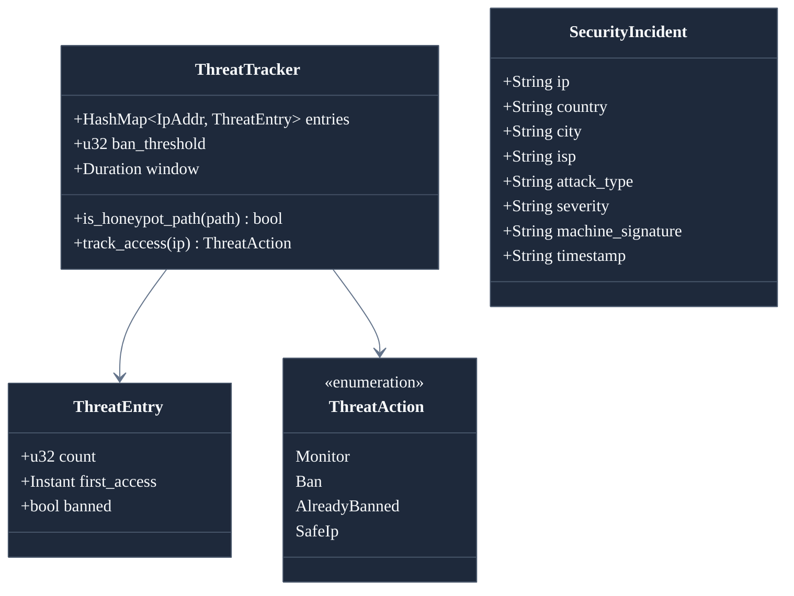
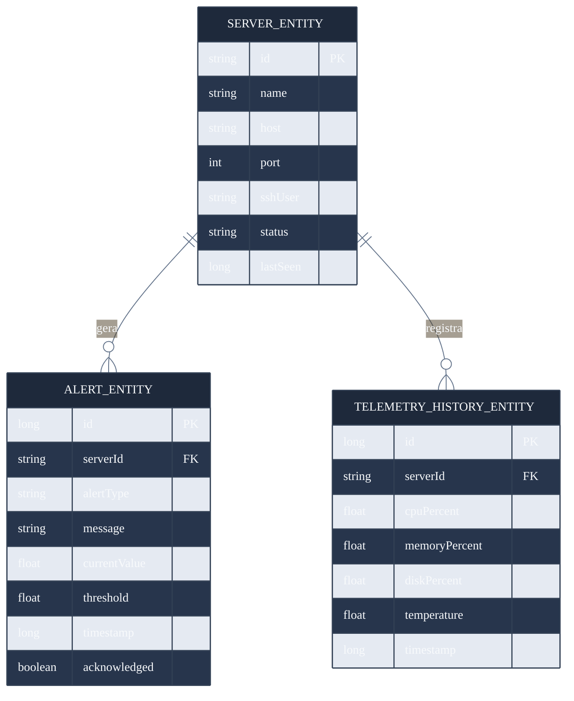
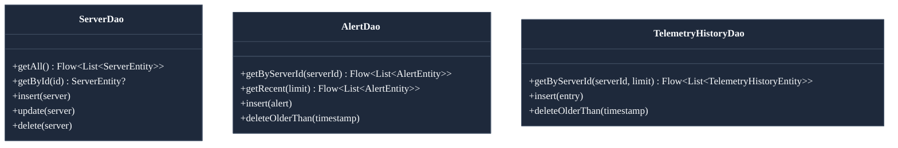
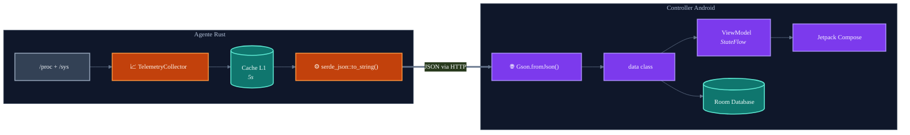

# Modelos de Dados — Pocket NOC

> Documentação dos modelos de dados utilizados no agente Rust e no Controller Android.  
> Autora: **Munique Alves Pacheco Feitoza**  
> Última atualização: Abril de 2026

---

## Sumário

1. [Visão Geral](#visão-geral)
2. [Diagrama de Classes — Agente (Rust)](#diagrama-de-classes--agente-rust)
3. [Diagrama de Classes — Controller (Android)](#diagrama-de-classes--controller-android)
4. [Diagrama ER — Persistência Local (Room)](#diagrama-er--persistência-local-room)
5. [Mapeamento Rust ↔ Kotlin](#mapeamento-rust--kotlin)
6. [Detalhamento dos Modelos](#detalhamento-dos-modelos)

---

## Visão Geral

O Pocket NOC utiliza modelos de dados serializados em JSON para comunicação entre o agente Rust e o Controller Android. O agente produz as structs em Rust (serializadas via `serde`), e o Android as consome como `data class` Kotlin (deserializadas via `Gson/Moshi`).

---

## Diagrama de Classes — Agente (Rust)

### Modelos de Alerta

### Modelos do Watchdog

### Modelos de Segurança

---

## Diagrama de Classes — Controller (Android)

```mermaid
%%{init: { "theme": "base", "themeVariables": { "fontFamily": "Inter, sans-serif", "primaryColor": "#1e293b", "primaryTextColor": "#f8fafc", "primaryBorderColor": "#475569", "lineColor": "#64748b" } }}%%
classDiagram
    class SystemTelemetry {
        +CpuMetrics cpu
        +MemoryMetrics memory
        +DiskMetrics disk
        +TemperatureMetrics? temperature
        +NetworkMetrics network
        +SecurityMetrics security
        +ProcessMetrics processes
        +UptimeInfo uptime
        +List~ServiceInfo~ services
        +Long timestamp
    }

    class Alert {
        +String alertType
        +String message
        +Float currentValue
        +Float threshold
        +Long timestamp
        +String? component
    }

    class EmergencyCommand {
        +String id
        +String description
        +String command
        +List~String~ args
    }

    class CommandListResponse {
        +List~EmergencyCommand~ commands
    }

    class CommandInfo {
        +String id
        +String description
        +String command
        +List~String~ args
        +Int timeout
    }

    class CommandResult {
        +String commandId
        +Int exitCode
        +String stdout
        +String stderr
        +Long timestamp
    }

    class WatchdogEvent {
        +String id
        +String service
        +String status
        +String message
        +Long timestamp
        +Boolean remediationAttempted
    }

    class DockerContainer {
        +String id
        +String name
        +String image
        +String status
        +String? ports
    }

    class SslCertificate {
        +String domain
        +String issuer
        +String expiresAt
        +Int daysRemaining
        +String status
    }

    class PhpFpmPool {
        +String site
        +String poolName
        +Int activeProcesses
        +Int idleProcesses
        +Int totalProcesses
        +Double memoryMb
        +Double cpuPercent
    }

    class BackupInfo {
        +String name
        +String lastRun
        +String status
        +Double sizeMb
        +Double ageHours
    }

    class HealthStatus {
        <<enumeration>>
        HEALTHY
        WARNING
        ALERT
        CRITICAL
        UNKNOWN
    }

    class ServerHealth {
        +String serverId
        +HealthStatus status
        +SystemTelemetry? telemetry
        +List~Alert~ alerts
    }

    ServerHealth --> HealthStatus
    ServerHealth --> SystemTelemetry
    ServerHealth --> Alert
```

---

## Diagrama ER — Persistência Local (Room)

### DAOs (Data Access Objects)

---

## Mapeamento Rust ↔ Kotlin

| Rust (serde) | Kotlin (data class) | JSON Field |
|:---|:---|:---|
| `SystemTelemetry` | `SystemTelemetry` | — |
| `CpuMetrics` | `CpuMetrics` | `cpu` |
| `MemoryMetrics` | `MemoryMetrics` | `memory` |
| `DiskMetrics` | `DiskMetrics` | `disk` |
| `TemperatureMetrics` | `TemperatureMetrics` | `temperature` |
| `NetworkMetrics` | `NetworkMetrics` | `network` |
| `SecurityMetrics` | `SecurityMetrics` | `security` |
| `ProcessMetrics` | `ProcessMetrics` | `processes` |
| `UptimeInfo` | `UptimeInfo` | `uptime` |
| `Vec<ServiceInfo>` | `List<ServiceInfo>` | `services` |
| `Alert` | `Alert` | — |
| `WatchdogEvent` | `WatchdogEvent` | — |
| `String` | `String` | — |
| `f32` / `f64` | `Float` / `Double` | — |
| `u32` / `u64` | `Int` / `Long` | — |
| `Option<T>` | `T?` (nullable) | — |
| `Vec<T>` | `List<T>` | — |
| `HashMap<K,V>` | `Map<K,V>` | — |

---

## Detalhamento dos Modelos

### Ciclo de Vida dos Dados

### Enums de Status

| Enum | Valores | Uso |
|:---|:---|:---|
| `AlertType` | `highcpu`, `highmemory`, `highdisk`, `hightemperature`, `securitythreat`, `recentreboot` | Classificação de alertas |
| `CircuitState` | `closed`, `open`, `halfopen` | Estado do circuit breaker |
| `ServiceStatus` | `active`, `inactive`, `failed`, `unknown` | Status de serviço systemd |
| `HealthStatus` | `HEALTHY`, `WARNING`, `ALERT`, `CRITICAL`, `UNKNOWN` | Saúde geral do servidor |
| `SslStatus` | `valid`, `expiring`, `expired` | Status de certificado SSL |

---

> **Documentação escrita por Munique Alves Pacheco Feitoza**  
> Engenharia de Software — Análise e Desenvolvimento de Sistemas
