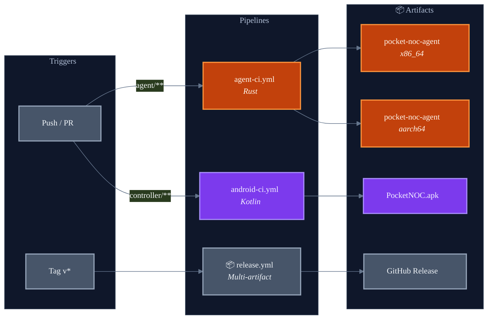
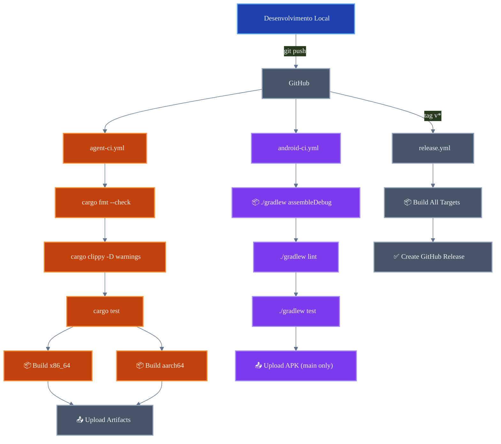
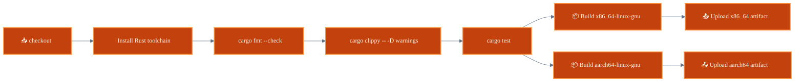
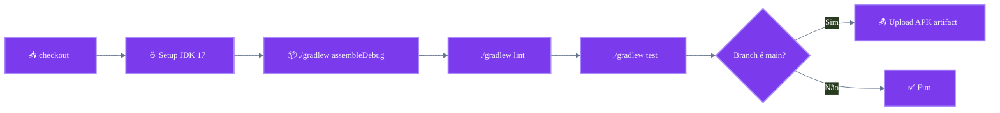
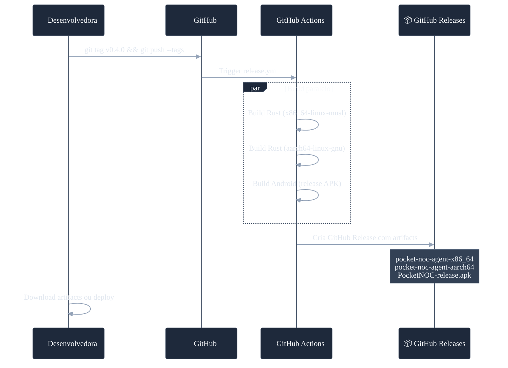
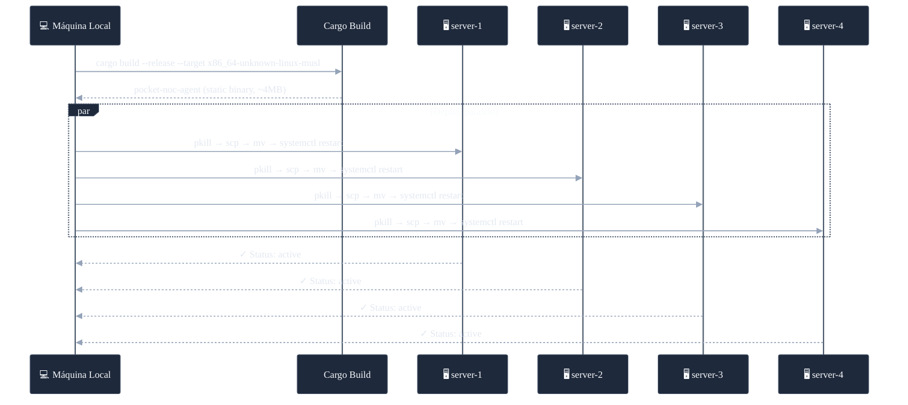
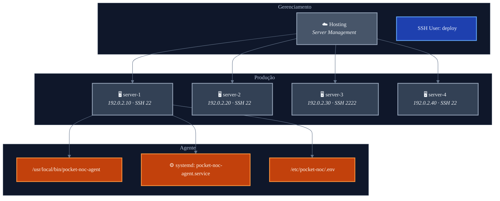
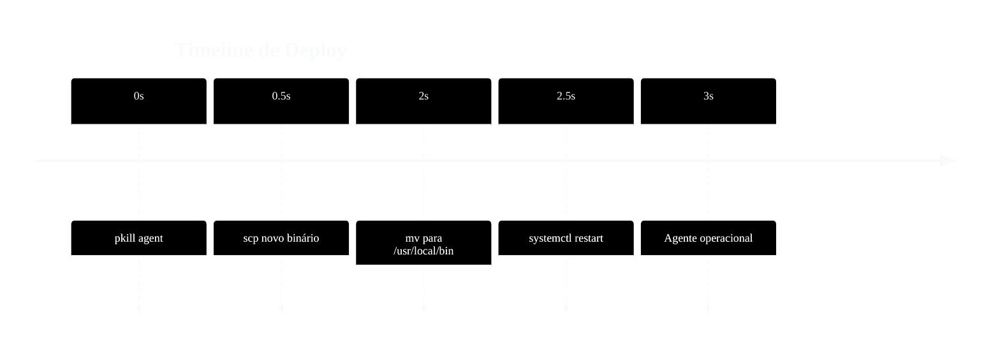

# CI/CD e Deployment — Pocket NOC

> Documentação das pipelines de integração contínua, entrega contínua e processo de deploy.  
> Autora: **Munique Alves Pacheco Feitoza**  
> Última atualização: Abril de 2026

---

## Sumário

1. [Visão Geral](#visão-geral)
2. [Arquitetura de CI/CD](#arquitetura-de-cicd)
3. [Pipeline do Agente (Rust)](#pipeline-do-agente-rust)
4. [Pipeline do Controller (Android)](#pipeline-do-controller-android)
5. [Pipeline de Release](#pipeline-de-release)
6. [Deploy em Produção](#deploy-em-produção)
7. [Infraestrutura de Produção](#infraestrutura-de-produção)
8. [Rollback](#rollback)

---

## Visão Geral

O Pocket NOC utiliza **GitHub Actions** para automação de CI/CD. Existem 3 pipelines independentes que garantem qualidade em cada camada do sistema.



---

## Arquitetura de CI/CD



---

## Pipeline do Agente (Rust)

**Arquivo:** `.github/workflows/agent-ci.yml`  
**Trigger:** Push/PR em `agent/**`

### Etapas



| Etapa | Comando | Critério |
|:---|:---|:---|
| Formatação | `cargo fmt --check` | Zero desvios |
| Linting | `cargo clippy -- -D warnings` | Zero warnings |
| Testes | `cargo test` | Todos passando |
| Build (x86_64) | `cargo build --release` | Sucesso |
| Build (aarch64) | `cargo build --release --target aarch64-unknown-linux-gnu` | Sucesso |

---

## Pipeline do Controller (Android)

**Arquivo:** `.github/workflows/android-ci.yml`  
**Trigger:** Push/PR em `controller/**`

### Etapas



| Etapa | Comando | Critério |
|:---|:---|:---|
| Build | `./gradlew assembleDebug` | Compilação sem erros |
| Lint | `./gradlew lint` | Sem erros críticos |
| Testes | `./gradlew test` | Todos passando |
| APK | Upload artifact | Apenas na branch `main` |

---

## Pipeline de Release

**Arquivo:** `.github/workflows/release.yml`  
**Trigger:** Push de tag `v*` (ex: `v0.4.0`)

### Fluxo de Release



### Artifacts da Release

| Artifact | Target | Descrição |
|:---|:---|:---|
| `pocket-noc-agent-x86_64` | `x86_64-unknown-linux-gnu` | Binário para servidores Intel/AMD |
| `pocket-noc-agent-aarch64` | `aarch64-unknown-linux-gnu` | Binário para servidores ARM |
| `PocketNOC-release.apk` | Android 7.0+ | App Android assinado |

---

## Deploy em Produção

### Deploy Automatizado (deploy.sh)

O script `deploy.sh` realiza o deploy completo em todos os servidores configurados.



### Passos do deploy.sh

```bash
# 1. Compilação local (musl estático)
cargo build --release --target x86_64-unknown-linux-musl

# 2. Para cada servidor:
pkill -9 pocket-noc-agent          # Para o processo
scp pocket-noc-agent user@host:~/  # Copia binário
ssh user@host "sudo mv ~/pocket-noc-agent /usr/local/bin/"
ssh user@host "sudo systemctl daemon-reload"
ssh user@host "sudo systemctl restart pocket-noc-agent"
ssh user@host "sudo systemctl status pocket-noc-agent"  # Verifica
```

### Execução

```bash
chmod +x deploy.sh
./deploy.sh
```

---

## Infraestrutura de Produção

### Servidores



| Servidor | IP | Porta SSH | Role |
|:---|:---|:---|:---|
| server-1 | `192.0.2.10` | 22 | wordpress |
| server-2 | `192.0.2.20` | 22 | wordpress |
| server-3 | `192.0.2.30` | 2222 | erp |
| server-4 | `192.0.2.40` | 22 | wordpress |

---

## Rollback

### Procedimento de Rollback

Em caso de problemas após deploy, o rollback é manual:

```bash
# 1. No servidor afetado, para o agente
ssh deploy@host "sudo systemctl stop pocket-noc-agent"

# 2. Restaura binário anterior (se houver backup)
ssh deploy@host "sudo cp /usr/local/bin/pocket-noc-agent.bak /usr/local/bin/pocket-noc-agent"

# 3. Reinicia
ssh deploy@host "sudo systemctl start pocket-noc-agent"

# 4. Verifica
ssh deploy@host "sudo systemctl status pocket-noc-agent"
```

### Estratégia de Zero Downtime

O agente reinicia em **< 1 segundo** (binário estático, sem warmup). O systemd garante `Restart=always` com `RestartSec=10`, minimizando o impacto de qualquer falha durante o deploy.



---

> **Documentação escrita por Munique Alves Pacheco Feitoza**  
> Engenharia de Software — Análise e Desenvolvimento de Sistemas
