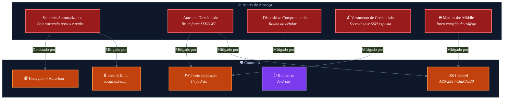
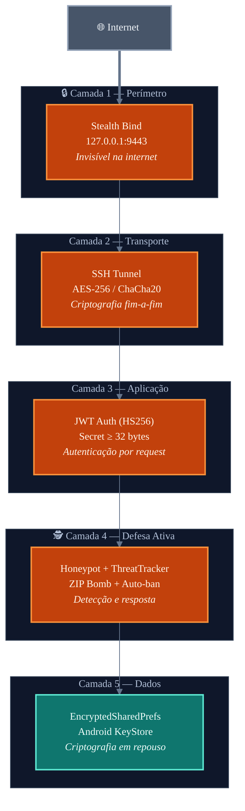
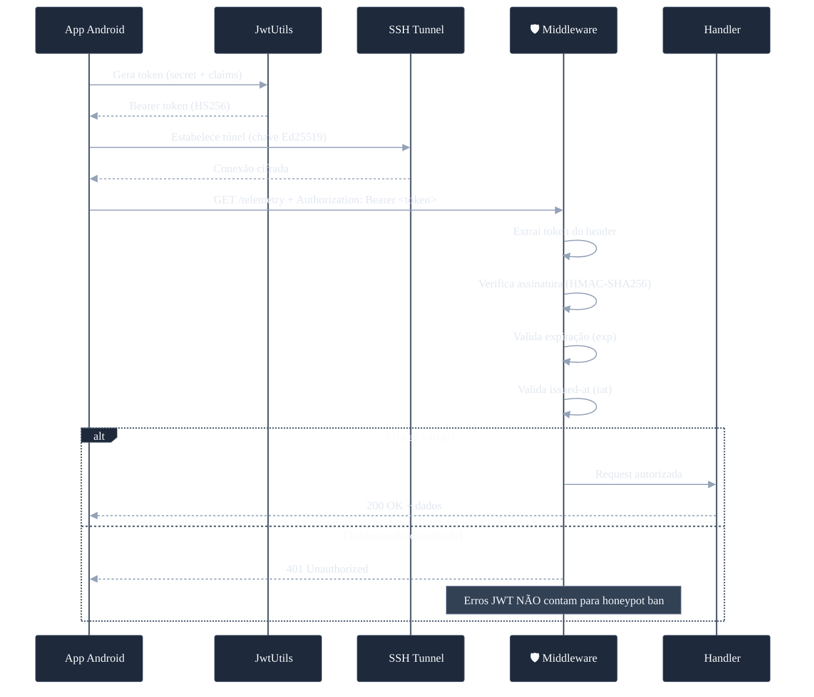
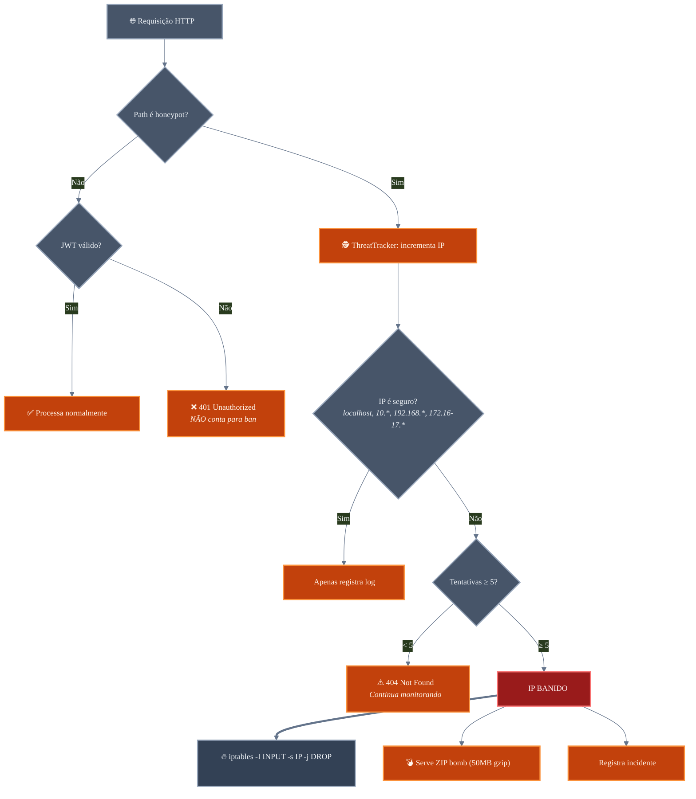
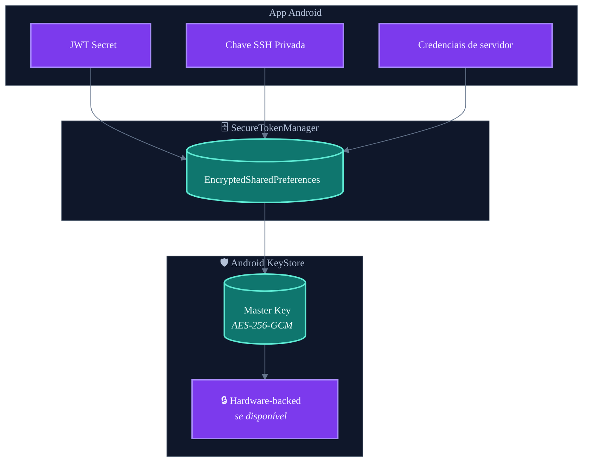
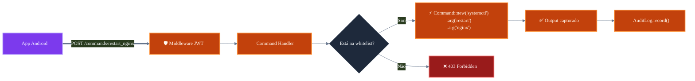
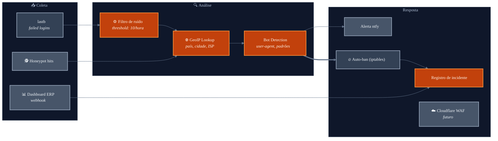

# Protocolos de Segurança — Pocket NOC

> Documentação do modelo de segurança multi-camada implementado no Pocket NOC.  
> Autora: **Munique Alves Pacheco Feitoza**  
> Última atualização: Abril de 2026

---

## Sumário

1. [Filosofia de Segurança](#filosofia-de-segurança)
2. [Modelo de Ameaças](#modelo-de-ameaças)
3. [Defesa em Profundidade](#defesa-em-profundidade)
4. [Autenticação e Autorização](#autenticação-e-autorização)
5. [Sistema de Defesa Ativa](#sistema-de-defesa-ativa)
6. [Proteção de Segredos no Mobile](#proteção-de-segredos-no-mobile)
7. [Segurança de Comandos](#segurança-de-comandos)
8. [Inteligência de Ameaças](#inteligência-de-ameaças)
9. [Hardening do Serviço](#hardening-do-serviço)
10. [Matriz de Controles](#matriz-de-controles)

---

## Filosofia de Segurança

A segurança no Pocket NOC não é um complemento — é o alicerce. Como o sistema gerencia acesso a servidores de produção com serviços críticos, implementei múltiplas camadas de proteção baseadas no princípio **Zero Trust**: nenhuma requisição é confiável por padrão, independente da origem.

---

## Modelo de Ameaças

### Atores de Ameaça



### Superfície de Ataque

| Vetor | Exposição | Mitigação |
|:---|:---|:---|
| Rede (scan de portas) | **Nula** | Agente ouve apenas em `127.0.0.1` — invisível a scanners |
| SSH brute force | Baixa | Autenticação por chave Ed25519/RSA (sem senha) |
| JWT replay | Baixa | Expiração de 1h + validação de `iat` |
| Dispositivo roubado | Média | Biometria + EncryptedSharedPreferences (Android KeyStore) |
| Shell injection | **Nula** | Whitelist de comandos + `Command::new()` sem shell |
| IP spoofing no block-ip | Baixa | Validação `std::net::IpAddr` — rejeita CIDRs |

---

## Defesa em Profundidade

O sistema implementa **5 camadas de defesa** independentes. A falha de qualquer camada individual não compromete o sistema.



### Camada 1: Stealth Bind (Perímetro)

O agente Rust faz bind exclusivamente em `127.0.0.1:9443`. Mesmo que o servidor tenha portas abertas no firewall, ninguém consegue falar com o agente diretamente da internet. O acesso é fisicamente impossível sem a chave SSH.

```rust
// agent/src/main.rs
let addr = SocketAddr::from(([127, 0, 0, 1], port));
```

### Camada 2: SSH Tunneling (Transporte)

Toda comunicação REST passa por um túnel SSH (Local Port Forwarding):

```bash
ssh -L 9443:127.0.0.1:9443 usuario@servidor
```

| Aspecto | Detalhe |
|:---|:---|
| **Criptografia** | AES-256-GCM ou ChaCha20-Poly1305 (negociado) |
| **Autenticação** | Par de chaves Ed25519 (recomendado) ou RSA-4096 |
| **Keep-alive** | 30 segundos (JSch no Android) |
| **Algoritmos** | `ssh-ed25519, ssh-rsa, rsa-sha2-256, rsa-sha2-512` |

### Camada 3: JWT Auth (Aplicação)

Mesmo dentro do túnel SSH, cada requisição HTTP precisa de um token JWT válido.

| Aspecto | Detalhe |
|:---|:---|
| **Algoritmo** | HS256 (HMAC-SHA256) |
| **Secret mínimo** | 32 bytes (enforcement no startup — OWASP) |
| **Expiração** | 1 hora padrão, máximo 30 dias |
| **Claims validados** | `exp`, `iat`, `sub`, `iss` |
| **Exceção** | Apenas `GET /health` (sem auth) |

### Camada 4: Defesa Ativa

Ver seção [Sistema de Defesa Ativa](#sistema-de-defesa-ativa).

### Camada 5: Proteção de Dados

Ver seção [Proteção de Segredos no Mobile](#proteção-de-segredos-no-mobile).

---

## Autenticação e Autorização

### Fluxo de Autenticação



---

## Sistema de Defesa Ativa

### Honeypot Paths

O middleware intercepta requisições a **30+ paths falsos** comumente explorados por scanners:

```
/wp-admin          /.env              /.git/config
/phpmyadmin        /admin             /xmlrpc.php
/wp-config.php     /wp-login.php      /.aws/credentials
/backup.sql        /database.sql      /config.php
/shell.php         /cmd.php           /eval.php
/.htaccess         /.htpasswd         /server-status
/actuator          /swagger           /graphql
```

### Fluxo de Detecção e Resposta



### Parâmetros do ThreatTracker

| Parâmetro | Valor |
|:---|:---|
| **Threshold de ban** | 5 acessos a honeypot paths |
| **Janela de reset** | 1 hora por IP |
| **IPs seguros** | `127.0.0.1`, `192.168.*`, `10.*`, `172.16-31.*` |
| **Ação no ban** | ZIP bomb (50MB) + `iptables -I INPUT -s <IP> -j DROP` |
| **Erros JWT** | **Não** contam para ban (protege devs com token expirado) |

---

## Proteção de Segredos no Mobile

### Diagrama de Armazenamento Seguro



**Medidas implementadas:**

| Medida | Descrição |
|:---|:---|
| **EncryptedSharedPreferences** | Secrets e chaves SSH criptografadas em repouso via Android KeyStore |
| **Hardware-backed** | Se o dispositivo suporta, a master key fica no secure element (TEE/StrongBox) |
| **Recovery anti-corrupção** | Se o arquivo de preferências corrompe, o `SecureTokenManager` recria automaticamente |
| **Zero log leak** | Nenhum token, secret ou metadado sensível é exposto no Logcat |
| **Mascaramento no agente** | O secret é logado apenas como `ABCD****` (4 primeiros chars + máscara) |
| **Biometria obrigatória** | Acesso ao app protegido por fingerprint/face via AndroidX Biometric |
| **Max auth failures** | Após 3 falhas de SSH, conexão é bloqueada para o servidor |

---

## Segurança de Comandos

O Action Center opera com uma **whitelist compilada** — não é possível executar comandos arbitrários.



**Garantias de segurança:**

- Apenas binários pré-definidos em **tempo de compilação**
- Argumentos passados via `Command::new()` — **sem shell intermediário**
- Sem interpolação de strings — **shell injection impossível**
- Cada execução registrada no **audit log**

**Comandos disponíveis:**
`restart_nginx`, `stop_nginx`, `start_nginx`, `restart_docker`, `start_docker`, `stop_docker`, `restart_mysql`, `restart_agent`, `clear_logs`, `disk_usage`

---

## Inteligência de Ameaças

### Pipeline de Inteligência



**Capacidades:**

| Funcionalidade | Descrição |
|:---|:---|
| **Filtro de ruído** | Apenas IPs com ≥ 10 tentativas/hora são reportados (foco em ataques reais) |
| **Timeout defensivo** | Leitura do `lastb` com timeout de 3s (previne travamento em `/var/log/btmp` grande) |
| **GeoIP** | País, cidade, ISP do atacante |
| **Bot detection** | Classificação automática bot/humano por user-agent e padrões |
| **Integração ERP** | Recebe incidentes do Dashboard Acme em tempo real |

---

## Hardening do Serviço

O arquivo systemd inclui hardening de segurança:

```ini
[Service]
User=pocketnoc                    # Usuário dedicado (não root)
Group=pocketnoc
MemoryMax=128M                    # Limite de memória
CPUQuota=5%                       # Limite de CPU
AmbientCapabilities=CAP_KILL CAP_NET_ADMIN  # Capabilities mínimas
CapabilityBoundingSet=CAP_KILL CAP_NET_ADMIN
Restart=always                    # Auto-restart em caso de crash
RestartSec=10                     # 10s entre restarts
```

| Aspecto | Detalhe |
|:---|:---|
| **Usuário** | `pocketnoc` (sem shell, sem home, sistema) |
| **Capabilities** | Apenas `CAP_KILL` (matar processos) e `CAP_NET_ADMIN` (iptables) |
| **Limites** | 128 MB RAM, 5% CPU — agente nunca impacta o servidor monitorado |
| **Secrets** | Via `EnvironmentFile` — nunca expostos em `ps aux` |

---

## Matriz de Controles

| Ameaça | Camada | Controle | Severidade | Status |
|:---|:---|:---|:---|:---|
| Scan de portas | Perímetro | Stealth bind (localhost) | Crítica | Implementado |
| MitM | Transporte | SSH tunnel (AES-256) | Crítica | Implementado |
| Token replay | Aplicação | JWT com expiração (1h) | Alta | Implementado |
| Brute force | Aplicação | Rate limit (60/min) + auto-ban | Alta | Implementado |
| Shell injection | Aplicação | Whitelist + Command::new() | Crítica | Implementado |
| Device theft | Dados | Biometria + EncryptedSharedPrefs | Alta | Implementado |
| Bot scanning | Defesa ativa | Honeypot + ZIP bomb | Média | Implementado* |
| IP spoofing | Aplicação | Validação std::net::IpAddr | Média | Implementado |
| Log leak | Dados | Mascaramento de secrets | Média | Implementado |
| Service exhaustion | Runtime | CPUQuota=5%, MemoryMax=128M | Média | Implementado |
| Certificado SSL expirado/quebrado | Defesa ativa | Monitor `check_all_ssl` cada 6h + ntfy (priority 4-5) | Alta | Implementado |
| Falha silenciosa em renovação SSL | Defesa ativa | Branch `no_cert`/`error` agora dispara ntfy (antes só logava) | Alta | Implementado |
| Varredura de SSL em domínios internos | Config | `SSL_SKIP_DOMAINS` env var — pula verificação em domínios que não precisam de cert público | Baixa | Implementado |
| Serviço crítico down sem remediação | Auto-healing | Watchdog role `generic` autodetecta php-fpm/mariadb/postgresql e remedia via `systemctl restart` | Alta | Implementado |

\* **Zip bomb / honeypot:** feature ativa mas atualmente sem blast radius real — o agente faz bind em `127.0.0.1` e não é acessível diretamente da internet (acesso só via SSH tunnel). O contador de honeypot nunca disparou nos 4 servidores em produção. Fica como defesa em profundidade caso algum dia a porta seja exposta.

---

> **Documentação escrita por Munique Alves Pacheco Feitoza**  
> Engenharia de Software — Análise e Desenvolvimento de Sistemas
