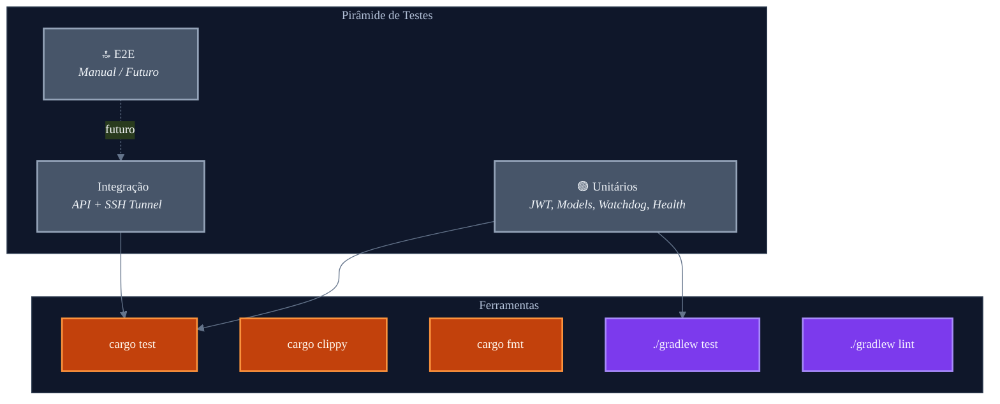
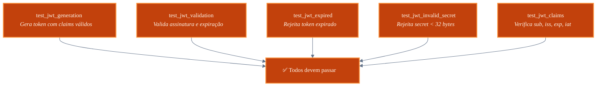
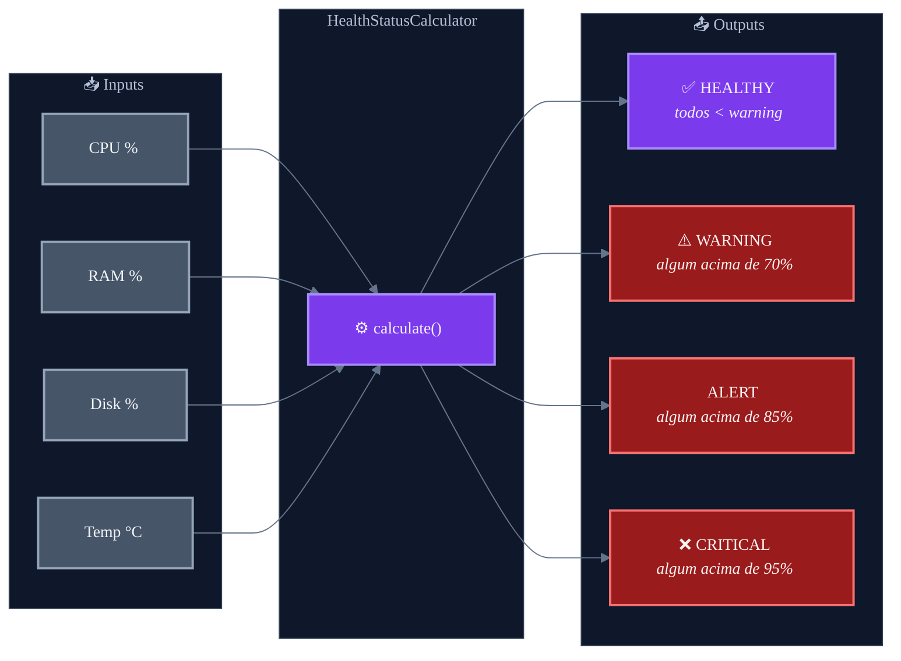
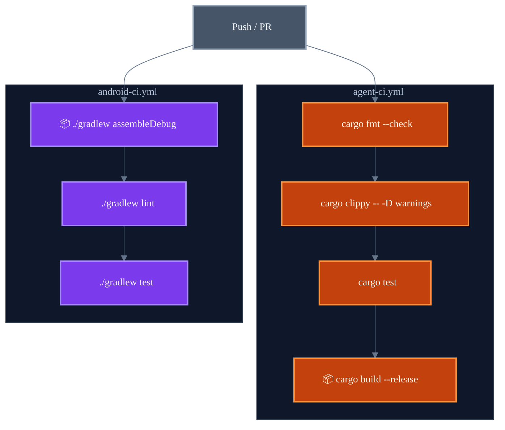

# Estratégia de Testes — Pocket NOC

> Documentação da estratégia de testes e qualidade do código.  
> Autora: **Munique Alves Pacheco Feitoza**  
> Última atualização: Abril de 2026

---

## Sumário

1. [Visão Geral](#visão-geral)
2. [Pirâmide de Testes](#pirâmide-de-testes)
3. [Testes do Agente (Rust)](#testes-do-agente-rust)
4. [Testes do Controller (Android)](#testes-do-controller-android)
5. [Análise Estática](#análise-estática)
6. [CI — Execução Automatizada](#ci--execução-automatizada)
7. [Como Executar](#como-executar)

---

## Visão Geral

O Pocket NOC adota uma estratégia de testes focada em **confiabilidade de componentes críticos**: autenticação JWT, lógica de cálculo de saúde, modelos de dados e watchdog. Os testes são executados automaticamente nas pipelines de CI/CD (GitHub Actions) em cada push e pull request.

---

## Pirâmide de Testes



---

## Testes do Agente (Rust)

### Suítes de Teste

| Arquivo | Cobertura | Descrição |
|:---|:---|:---|
| `tests/api_tests.rs` | Autenticação JWT | Geração de token, validação de claims, expiração, secret inválido |
| `tests/watchdog_tests.rs` | WatchdogEngine | Circuit breaker (Closed/Open/HalfOpen), probes, remediação |

### Testes de JWT (`api_tests.rs`)



**Cenários cobertos:**
- Geração de token com claims válidos
- Validação de assinatura HMAC-SHA256
- Rejeição de token expirado
- Rejeição de secret menor que 32 bytes
- Verificação de claims `sub`, `iss`, `exp`, `iat`

### Testes do Watchdog (`watchdog_tests.rs`)

**Cenários cobertos:**
- Transição de estados do Circuit Breaker: Closed → Open → HalfOpen → Closed
- Contagem de falhas e reset após sucesso
- Cooldown timer entre estados Open e HalfOpen
- Probes HTTP, TCP e Systemctl (mocks)
- Ring buffer de eventos (inserção e limite de 500)

### Execução

```bash
cd agent

# Todos os testes
cargo test

# Testes com output detalhado
cargo test -- --nocapture

# Teste específico
cargo test test_jwt_generation

# Testes de um arquivo
cargo test --test api_tests
cargo test --test watchdog_tests
```

---

## Testes do Controller (Android)

### Suítes de Teste

| Arquivo | Cobertura | Descrição |
|:---|:---|:---|
| `ModelsTest.kt` | Modelos de dados | Serialização/deserialização JSON, valores default, nullability |
| `HealthStatusCalculatorTest.kt` | Cálculo de saúde | Classificação HEALTHY/WARNING/ALERT/CRITICAL por thresholds |

### Testes de Modelos (`ModelsTest.kt`)

**Cenários cobertos:**
- Criação de `SystemTelemetry` com todos os campos
- Serialização para JSON e deserialização de volta
- Campos opcionais (nullable) com valor nulo
- Valores default dos data classes
- Estrutura de `Alert`, `WatchdogEvent`, `DockerContainer`, etc.

### Testes do Health Calculator (`HealthStatusCalculatorTest.kt`)



**Cenários cobertos:**
- Servidor saudável (todos os valores baixos)
- Warning (CPU entre 70-85%)
- Alert (memória entre 85-95%)
- Critical (disco acima de 95%)
- Múltiplos alertas simultâneos (prioridade do mais grave)
- Valores nulos/ausentes (default para UNKNOWN)

### Execução

```bash
cd controller

# Todos os testes unitários
./gradlew test

# Testes com relatório HTML
./gradlew testDebugUnitTest

# Teste de uma classe específica
./gradlew test --tests "com.pocketnoc.ModelsTest"
./gradlew test --tests "com.pocketnoc.HealthStatusCalculatorTest"
```

---

## Análise Estática

### Rust — Clippy + Fmt

| Ferramenta | Propósito | Configuração |
|:---|:---|:---|
| `cargo clippy` | Linting avançado (anti-patterns, performance, correctness) | `-- -D warnings` (zero warnings) |
| `cargo fmt` | Formatação consistente | `--check` (falha se não formatado) |

### Android — Lint

| Ferramenta | Propósito |
|:---|:---|
| `./gradlew lint` | Análise estática Android (deprecated APIs, accessibility, security) |

---

## CI — Execução Automatizada

Os testes são executados automaticamente pelo GitHub Actions em cada push e pull request.



### Critérios de Aprovação

| Critério | Agente (Rust) | Controller (Android) |
|:---|:---|:---|
| Formatação | `cargo fmt --check` | — |
| Lint | `cargo clippy -D warnings` | `./gradlew lint` |
| Testes | `cargo test` | `./gradlew test` |
| Build | `cargo build --release` | `./gradlew assembleDebug` |

---

## Como Executar

### Agente (Rust) — Completo

```bash
cd agent

# 1. Formatação
cargo fmt --check

# 2. Linting (zero warnings)
cargo clippy -- -D warnings

# 3. Testes
cargo test

# 4. Build de produção
cargo build --release --target x86_64-unknown-linux-musl
```

### Controller (Android) — Completo

```bash
cd controller

# 1. Build
./gradlew assembleDebug

# 2. Lint
./gradlew lint

# 3. Testes unitários
./gradlew test
```

---

> **Documentação escrita por Munique Alves Pacheco Feitoza**  
> Engenharia de Software — Análise e Desenvolvimento de Sistemas
